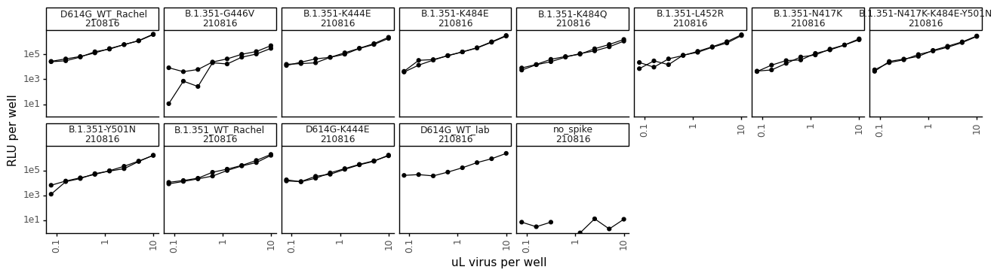
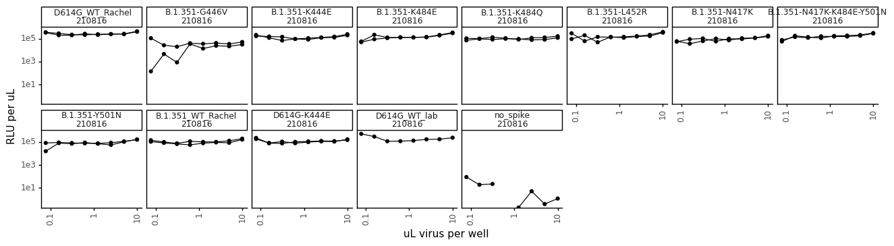

# Calculate titers of RBD mutant spike-pseudotyped lentiviruses
Experiments by Rachel Eguia.


```python
import os
import warnings

import math
import numpy as np 

from IPython.display import display, HTML
import matplotlib.pyplot as plt

from neutcurve.colorschemes import CBMARKERS, CBPALETTE

import pandas as pd
from plotnine import *
```


```python
warnings.simplefilter('ignore')
```

Make output directory if needed


```python
resultsdir = './results/entry_titers'
os.makedirs(resultsdir, exist_ok=True)
```


```python
titerdir = 'data/entry_titers/'
titers = pd.DataFrame() # create empty data frame

for f in os.listdir(titerdir):
    titerfile = os.path.join(titerdir, f)
    print(titerfile)
    titers = titers.append(pd.read_csv(titerfile)).reset_index(drop=True)
    
titers = (titers
          .assign(RLUperuL=lambda x: x['RLU_per_well'] / x['uL_virus'],
                  date=lambda x: x['date'].astype(str)
                 )
         )

display(HTML(titers.head().to_html(index=False)))
```

    data/entry_titers/16Aug21_B.1.351_RLU.csv


<table border="1" class="dataframe">
  <thead>
    <tr style="text-align: right;">
      <th>plasmid</th>
      <th>replicate</th>
      <th>virus</th>
      <th>dilution</th>
      <th>uL_virus</th>
      <th>RLU_per_well</th>
      <th>date</th>
      <th>RLUperuL</th>
    </tr>
  </thead>
  <tbody>
    <tr>
      <td>2984</td>
      <td>rep1</td>
      <td>B.1.351-G446V</td>
      <td>0.10000</td>
      <td>10.000</td>
      <td>506085</td>
      <td>210816</td>
      <td>50608.5</td>
    </tr>
    <tr>
      <td>2984</td>
      <td>rep1</td>
      <td>B.1.351-G446V</td>
      <td>0.05000</td>
      <td>5.000</td>
      <td>170951</td>
      <td>210816</td>
      <td>34190.2</td>
    </tr>
    <tr>
      <td>2984</td>
      <td>rep1</td>
      <td>B.1.351-G446V</td>
      <td>0.02500</td>
      <td>2.500</td>
      <td>102446</td>
      <td>210816</td>
      <td>40978.4</td>
    </tr>
    <tr>
      <td>2984</td>
      <td>rep1</td>
      <td>B.1.351-G446V</td>
      <td>0.01250</td>
      <td>1.250</td>
      <td>43835</td>
      <td>210816</td>
      <td>35068.0</td>
    </tr>
    <tr>
      <td>2984</td>
      <td>rep1</td>
      <td>B.1.351-G446V</td>
      <td>0.00625</td>
      <td>0.625</td>
      <td>24680</td>
      <td>210816</td>
      <td>39488.0</td>
    </tr>
  </tbody>
</table>


```python
ncol=min(8, titers['virus'].nunique())
nrow=math.ceil(titers['virus'].nunique() / ncol)

p = (ggplot(titers.dropna()
            ) +
     aes('uL_virus', 'RLU_per_well', group='replicate') +
     geom_point(size=1.5) +
     geom_line() +
     facet_wrap('~virus+date', ncol=ncol) +
     scale_y_log10(name='RLU per well') +
     scale_x_log10(name='uL virus per well') +
     theme_classic() +
     theme(axis_text_x=element_text(angle=90),
           figure_size=(2 * ncol, 1.75 * nrow),
           )
     )

_ = p.draw()

plotfile = os.path.join(resultsdir, 'RLU-vs-uL.pdf')
print(f"Saving to {plotfile}")
p.save(plotfile, verbose=False)
```

    Saving to ./results/entry_titers/RLU-vs-uL.pdf


    

    


```python
p = (ggplot(titers.dropna()
            ) +
     aes('uL_virus', 'RLUperuL', group='replicate') +
     geom_point(size=1.5) +
     geom_line() +
     facet_wrap('~virus+date', ncol=ncol) +
     scale_y_log10(name='RLU per uL') +
     scale_x_log10(name='uL virus per well') +
     theme_classic() +
     theme(axis_text_x=element_text(angle=90),
           figure_size=(2 * ncol, 1.75 * nrow),
           ) 
     )

_ = p.draw()

plotfile = os.path.join(resultsdir, 'RLUperuL.pdf')
print(f"Saving to {plotfile}")
p.save(plotfile, verbose=False)
```

    Saving to ./results/entry_titers/RLUperuL.pdf


    

    


From visual inspection of the above plots, it appears that only the 5 highest dilutions (i.e., >0.5uL of virus per well) are reliable enough to calculate titers. 


```python
average_titers = (titers
                  .dropna() # missing values for some replicates
                  .query('uL_virus > 0.5') # drop lowest concentration of virus
                  .groupby(['virus', 'replicate', 'date'])
                  .agg(mean_RLUperuL=pd.NamedAgg(column='RLUperuL', aggfunc=np.mean))
                  .reset_index()
                 )

display(HTML(average_titers.head().to_html(index=False)))
```


<table border="1" class="dataframe">
  <thead>
    <tr style="text-align: right;">
      <th>virus</th>
      <th>replicate</th>
      <th>date</th>
      <th>mean_RLUperuL</th>
    </tr>
  </thead>
  <tbody>
    <tr>
      <td>D614G_WT_Rachel</td>
      <td>rep1</td>
      <td>210816</td>
      <td>276356.50</td>
    </tr>
    <tr>
      <td>D614G_WT_Rachel</td>
      <td>rep2</td>
      <td>210816</td>
      <td>273492.12</td>
    </tr>
    <tr>
      <td>B.1.351-G446V</td>
      <td>rep1</td>
      <td>210816</td>
      <td>40066.62</td>
    </tr>
    <tr>
      <td>B.1.351-G446V</td>
      <td>rep2</td>
      <td>210816</td>
      <td>24789.14</td>
    </tr>
    <tr>
      <td>B.1.351-K444E</td>
      <td>rep1</td>
      <td>210816</td>
      <td>143087.90</td>
    </tr>
  </tbody>
</table>


```python
p = (ggplot(average_titers, 
            aes(x='virus', y='mean_RLUperuL', color='date')
           ) +
     geom_point(size=2.5, alpha=0.5)+
     theme_classic() +
     theme(axis_text_x=element_text(angle=90, vjust=1, hjust=0.5),
           figure_size=(average_titers['virus'].nunique()*0.35,2),
           axis_title_x=element_blank(),
          ) +
     scale_y_log10(limits=[1,1.1e6]) +
     ylab('relative luciferase units\nper uL')+
     labs(title='pseudovirus entry titers') +
     scale_color_manual(values=CBPALETTE)
    )

_ = p.draw()

plotfile = os.path.join(resultsdir, 'entry_titers.pdf')
print(f"Saving to {plotfile}")
p.save(plotfile, verbose=False)
```

    Saving to ./results/entry_titers/entry_titers.pdf


    

    


Calculate how much virus to use in neut assays:


```python
target_RLU = 2.5e5
uL_virus_per_well = 50

dilute_virus = (average_titers
                .groupby(['virus', 'date'])
                .agg(RLUperuL=pd.NamedAgg(column='mean_RLUperuL', aggfunc=np.mean))
                .reset_index()
                .assign(target_RLU = target_RLU,
                        uL_virus_per_well = uL_virus_per_well,
                        dilution_factor = lambda x: x['RLUperuL']/target_RLU*uL_virus_per_well,
                        uL_per_6mL = lambda x: 6000/x['dilution_factor']
                       )
               )


titerfile = os.path.join(resultsdir, 'titers.csv')
print(f"Saving to {titerfile}")

dilute_virus.to_csv(titerfile, index=False)

display(HTML(dilute_virus.head().to_html(index=False)))
```

    Saving to ./results/entry_titers/titers.csv


<table border="1" class="dataframe">
  <thead>
    <tr style="text-align: right;">
      <th>virus</th>
      <th>date</th>
      <th>RLUperuL</th>
      <th>target_RLU</th>
      <th>uL_virus_per_well</th>
      <th>dilution_factor</th>
      <th>uL_per_6mL</th>
    </tr>
  </thead>
  <tbody>
    <tr>
      <td>D614G_WT_Rachel</td>
      <td>210816</td>
      <td>274924.31</td>
      <td>250000.0</td>
      <td>50</td>
      <td>54.984862</td>
      <td>109.120943</td>
    </tr>
    <tr>
      <td>B.1.351-G446V</td>
      <td>210816</td>
      <td>32427.88</td>
      <td>250000.0</td>
      <td>50</td>
      <td>6.485576</td>
      <td>925.129857</td>
    </tr>
    <tr>
      <td>B.1.351-K444E</td>
      <td>210816</td>
      <td>133286.44</td>
      <td>250000.0</td>
      <td>50</td>
      <td>26.657288</td>
      <td>225.079160</td>
    </tr>
    <tr>
      <td>B.1.351-K484E</td>
      <td>210816</td>
      <td>181289.72</td>
      <td>250000.0</td>
      <td>50</td>
      <td>36.257944</td>
      <td>165.480977</td>
    </tr>
    <tr>
      <td>B.1.351-K484Q</td>
      <td>210816</td>
      <td>106080.32</td>
      <td>250000.0</td>
      <td>50</td>
      <td>21.216064</td>
      <td>282.804577</td>
    </tr>
  </tbody>
</table>


```python

```
