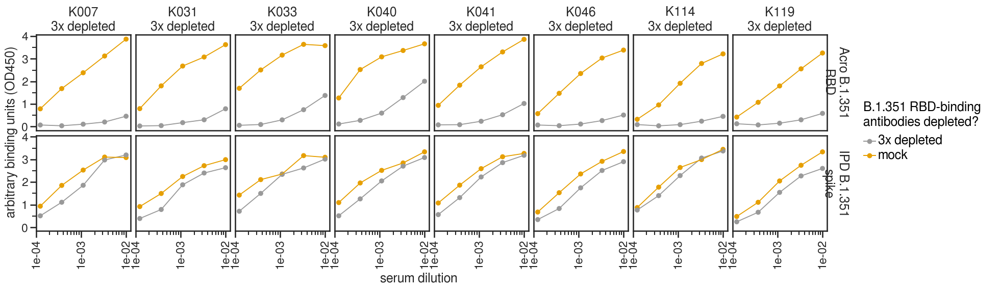
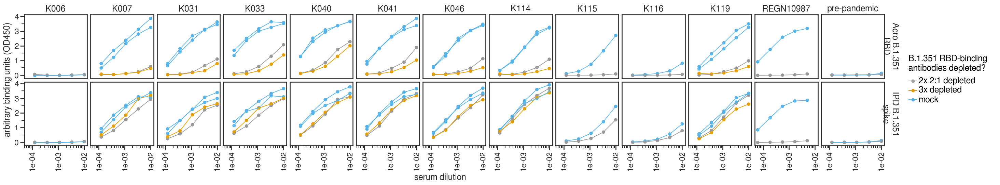

# Pilot RBD depletions with B.1.351 protein and plasmas

### Set up Analysis

Import packages.


```python
import itertools
import math
import os
import re
import warnings

from IPython.display import display, HTML

import matplotlib
from matplotlib.backends.backend_pdf import PdfPages
import matplotlib as mpl
import matplotlib.pyplot as plt
from mizani.formatters import scientific_format
import natsort

import numpy as np
import pandas as pd
from plotnine import *
import seaborn

import neutcurve
from neutcurve.colorschemes import CBMARKERS, CBPALETTE
import seaborn

import lifelines
import sklearn
import scipy.stats

import yaml
```


```python
warnings.simplefilter('ignore')
```

Use seaborn theme and change font:


```python
theme_set(theme_seaborn(style='white', context='talk', font='FreeSans', font_scale=1))
plt.style.use('seaborn-white')
```

Read config file:


```python
with open('config.yaml') as f:
    config = yaml.safe_load(f)
```


```python
datadir=config['elisa_data_dir']

resultsdir='results'
os.makedirs(resultsdir, exist_ok=True)
```


```python
pd.options.display.max_rows = 100
```


```python
data = os.path.join(datadir, '210415_ELISA_pilot_RE.csv')

titration_df = (pd.read_csv(data)
                .melt(
                        id_vars=['serum', 'depleted', 'ratio_beads', 'amount_RBD_protein', 'ligand', 'date'], 
                        var_name='dilution_factor', 
                        value_name='OD450'
                       )
                .assign(dilution_factor=lambda x: x['dilution_factor'].astype(int),
                        dilution=lambda x: 1/x['dilution_factor'],
                        amount_RBD_protein=lambda x: pd.Categorical(x['amount_RBD_protein'], natsort.natsorted(x['amount_RBD_protein'].unique())[::-1], ordered=True)
                       )
                .replace({'2to1':'2:1 beads', '1to1':'1:1 beads'})
               )

display(titration_df.head(2))  # display first few lines
```


<div>
<style scoped>
    .dataframe tbody tr th:only-of-type {
        vertical-align: middle;
    }

    .dataframe tbody tr th {
        vertical-align: top;
    }

    .dataframe thead th {
        text-align: right;
    }
</style>
<table border="1" class="dataframe">
  <thead>
    <tr style="text-align: right;">
      <th></th>
      <th>serum</th>
      <th>depleted</th>
      <th>ratio_beads</th>
      <th>amount_RBD_protein</th>
      <th>ligand</th>
      <th>date</th>
      <th>dilution_factor</th>
      <th>OD450</th>
      <th>dilution</th>
    </tr>
  </thead>
  <tbody>
    <tr>
      <th>0</th>
      <td>CR3022</td>
      <td>mock 1:1</td>
      <td>1:1 beads</td>
      <td>none</td>
      <td>B.1.351 RBD</td>
      <td>210415</td>
      <td>100</td>
      <td>3.41205</td>
      <td>0.01</td>
    </tr>
    <tr>
      <th>1</th>
      <td>CR3022</td>
      <td>10 ug/mg beads 1:1</td>
      <td>1:1 beads</td>
      <td>10 ug/mg beads</td>
      <td>B.1.351 RBD</td>
      <td>210415</td>
      <td>100</td>
      <td>3.27480</td>
      <td>0.01</td>
    </tr>
  </tbody>
</table>
</div>


```python
nconditions = titration_df['serum'].nunique()
# ncol = np.minimum(6, nconditions)
ncol=6
nrow = math.ceil(nconditions / ncol)

p = (
    ggplot((titration_df),
           aes('dilution', 
               'OD450', 
               color='amount_RBD_protein',
               )) +
    geom_point(size=3) +
    geom_path(aes(color='amount_RBD_protein'), size=0.75) +
    scale_x_log10(name='serum dilution', labels=scientific_format(digits=0)) +
    facet_wrap('~ serum + ratio_beads ', ncol=ncol) +
    theme(figure_size=(2 * ncol, 2.5 * nrow),
          axis_text_x=element_text(angle=90),
          subplots_adjust={'hspace':1},
          strip_background=element_blank()
         ) +
    scale_color_manual(values=CBPALETTE[0:], name='RBD protein\nconjugated to beads') +
    ylab('arbitrary binding units\n(OD450)')
    )

_ = p.draw()

p.save(f'{resultsdir}/210415_pilot.pdf')
```


    

    


New experiment testing the free sample of commerical beads we got from Acro


```python
data = os.path.join(datadir, '210507_ELISA_pilot_RE.csv')

titration_df = (pd.read_csv(data)
                .melt(
                        id_vars=['serum', 'depleted', 'ratio_beads', 'amount_RBD_protein', 'ligand', 'date'], 
                        var_name='dilution_factor', 
                        value_name='OD450'
                       )
                .assign(dilution_factor=lambda x: x['dilution_factor'].astype(int),
                        dilution=lambda x: 1/x['dilution_factor'],
                        amount_RBD_protein=lambda x: pd.Categorical(x['amount_RBD_protein'], natsort.natsorted(x['amount_RBD_protein'].unique())[::-1], ordered=True)
                       )
                .replace({'2to1':'2x 2:1 beads', '1to1':'1:1 beads',
                          'Acro_beads':'Acro RBD and beads conjugated by Acro',
                          'Rachel_beads':'Acro RBD and beads conjugated by Rachel',
                          'no_beads':'no beads',
                          'RBD':'Acro B.1.351\nRBD',
                          'spike':'IPD B.1.351\nspike'
                         }
                        )
               )

display(titration_df.head(2))  # display first few lines
```


<div>
<style scoped>
    .dataframe tbody tr th:only-of-type {
        vertical-align: middle;
    }

    .dataframe tbody tr th {
        vertical-align: top;
    }

    .dataframe thead th {
        text-align: right;
    }
</style>
<table border="1" class="dataframe">
  <thead>
    <tr style="text-align: right;">
      <th></th>
      <th>serum</th>
      <th>depleted</th>
      <th>ratio_beads</th>
      <th>amount_RBD_protein</th>
      <th>ligand</th>
      <th>date</th>
      <th>dilution_factor</th>
      <th>OD450</th>
      <th>dilution</th>
    </tr>
  </thead>
  <tbody>
    <tr>
      <th>0</th>
      <td>CR3022</td>
      <td>no beads</td>
      <td>2x 2:1 beads</td>
      <td>100ug</td>
      <td>Acro B.1.351\nRBD</td>
      <td>210507</td>
      <td>100</td>
      <td>3.9127</td>
      <td>0.01</td>
    </tr>
    <tr>
      <th>1</th>
      <td>CR3022</td>
      <td>Acro RBD and beads conjugated by Acro</td>
      <td>2x 2:1 beads</td>
      <td>100ug</td>
      <td>Acro B.1.351\nRBD</td>
      <td>210507</td>
      <td>100</td>
      <td>0.2540</td>
      <td>0.01</td>
    </tr>
  </tbody>
</table>
</div>


```python
ncol=titration_df['serum'].nunique()
nrow =titration_df['ligand'].nunique()

p = (
    ggplot((titration_df),
           aes('dilution', 
               'OD450', 
               color='depleted',
               )) +
    geom_point(size=3) +
    geom_path(aes(color='depleted'), size=0.75) +
    scale_x_log10(name='serum dilution', labels=scientific_format(digits=0)) +
    facet_grid('ligand~ serum + ratio_beads') +
    theme(figure_size=(2.5 * ncol, 2.5 * nrow),
          axis_text_x=element_text(angle=90),
          strip_background=element_blank(),
          strip_margin_y=0.35,
         ) +
    scale_color_manual(values=CBPALETTE[0:], name='B.1.351 RBD beads used in depletion') +
    ylab('arbitrary binding units (OD450)')
    )

_ = p.draw()

p.save(f'{resultsdir}/210507_pilot.pdf')
p.save(f'{resultsdir}/210507_pilot.png')
```


    

    


## Depleting B.1.351 sera with the Acro beads
May 12, 2021
Rachel used the Acro beads, 2x depletions at 2:1 ratio


```python
data = os.path.join(datadir, '210512_ELISA_2xdep.csv')

titration_df = (pd.read_csv(data)
                .melt(
                        id_vars=['serum', 'depleted', 'ratio_beads', 'amount_RBD_protein', 'ligand', 'date'], 
                        var_name='dilution_factor', 
                        value_name='OD450'
                       )
                .assign(dilution_factor=lambda x: x['dilution_factor'].astype(int),
                        dilution=lambda x: 1/x['dilution_factor'],
                       )
                .replace({'2to1':'2x 2:1 beads', '1to1':'1:1 beads',
                          'RBD':'Acro B.1.351\nRBD',
                          'spike':'IPD B.1.351\nspike'
                         }
                        )
               )

display(titration_df)  # display first few lines

ncol=titration_df['serum'].nunique()
nrow =titration_df['ligand'].nunique()

p = (
    ggplot((titration_df),
           aes('dilution', 
               'OD450', 
               color='depleted',
               )) +
    geom_point(size=3) +
    geom_path(aes(color='depleted'), size=0.75) +
    scale_x_log10(name='serum dilution', labels=scientific_format(digits=0)) +
    facet_grid('ligand~ serum + ratio_beads') +
    theme(figure_size=(2.5 * ncol, 2.5 * nrow),
          axis_text_x=element_text(angle=90),
          strip_background=element_blank(),
          strip_margin_y=0.35,
         ) +
    scale_color_manual(values=CBPALETTE[0:], name='B.1.351 RBD-binding\nantibodies depleted?') +
    ylab('arbitrary binding units (OD450)')
    )

_ = p.draw()

p.save(f'{resultsdir}/210512_ELISA.pdf', limitsize=False)
p.save(f'{resultsdir}/210512_ELISA.png', limitsize=False)
```


<div>
<style scoped>
    .dataframe tbody tr th:only-of-type {
        vertical-align: middle;
    }

    .dataframe tbody tr th {
        vertical-align: top;
    }

    .dataframe thead th {
        text-align: right;
    }
</style>
<table border="1" class="dataframe">
  <thead>
    <tr style="text-align: right;">
      <th></th>
      <th>serum</th>
      <th>depleted</th>
      <th>ratio_beads</th>
      <th>amount_RBD_protein</th>
      <th>ligand</th>
      <th>date</th>
      <th>dilution_factor</th>
      <th>OD450</th>
      <th>dilution</th>
    </tr>
  </thead>
  <tbody>
    <tr>
      <th>0</th>
      <td>K006</td>
      <td>mock</td>
      <td>2x 2:1 beads</td>
      <td>100ug</td>
      <td>Acro B.1.351\nRBD</td>
      <td>210512</td>
      <td>100</td>
      <td>0.0281</td>
      <td>0.010000</td>
    </tr>
    <tr>
      <th>1</th>
      <td>K007</td>
      <td>mock</td>
      <td>2x 2:1 beads</td>
      <td>100ug</td>
      <td>Acro B.1.351\nRBD</td>
      <td>210512</td>
      <td>100</td>
      <td>3.2543</td>
      <td>0.010000</td>
    </tr>
    <tr>
      <th>2</th>
      <td>K031</td>
      <td>mock</td>
      <td>2x 2:1 beads</td>
      <td>100ug</td>
      <td>Acro B.1.351\nRBD</td>
      <td>210512</td>
      <td>100</td>
      <td>3.4500</td>
      <td>0.010000</td>
    </tr>
    <tr>
      <th>3</th>
      <td>K033</td>
      <td>mock</td>
      <td>2x 2:1 beads</td>
      <td>100ug</td>
      <td>Acro B.1.351\nRBD</td>
      <td>210512</td>
      <td>100</td>
      <td>3.5232</td>
      <td>0.010000</td>
    </tr>
    <tr>
      <th>4</th>
      <td>K040</td>
      <td>mock</td>
      <td>2x 2:1 beads</td>
      <td>100ug</td>
      <td>Acro B.1.351\nRBD</td>
      <td>210512</td>
      <td>100</td>
      <td>3.6484</td>
      <td>0.010000</td>
    </tr>
    <tr>
      <th>...</th>
      <td>...</td>
      <td>...</td>
      <td>...</td>
      <td>...</td>
      <td>...</td>
      <td>...</td>
      <td>...</td>
      <td>...</td>
      <td>...</td>
    </tr>
    <tr>
      <th>475</th>
      <td>REGN10987</td>
      <td>mock</td>
      <td>2x 2:1 beads</td>
      <td>100ug</td>
      <td>IPD B.1.351\nspike</td>
      <td>210512</td>
      <td>16200</td>
      <td>0.8484</td>
      <td>0.000062</td>
    </tr>
    <tr>
      <th>476</th>
      <td>K115</td>
      <td>2x 2:1 depleted</td>
      <td>2x 2:1 beads</td>
      <td>100ug</td>
      <td>IPD B.1.351\nspike</td>
      <td>210512</td>
      <td>16200</td>
      <td>NaN</td>
      <td>0.000062</td>
    </tr>
    <tr>
      <th>477</th>
      <td>K116</td>
      <td>2x 2:1 depleted</td>
      <td>2x 2:1 beads</td>
      <td>100ug</td>
      <td>IPD B.1.351\nspike</td>
      <td>210512</td>
      <td>16200</td>
      <td>NaN</td>
      <td>0.000062</td>
    </tr>
    <tr>
      <th>478</th>
      <td>K119</td>
      <td>2x 2:1 depleted</td>
      <td>2x 2:1 beads</td>
      <td>100ug</td>
      <td>IPD B.1.351\nspike</td>
      <td>210512</td>
      <td>16200</td>
      <td>NaN</td>
      <td>0.000062</td>
    </tr>
    <tr>
      <th>479</th>
      <td>REGN10987</td>
      <td>2x 2:1 depleted</td>
      <td>2x 2:1 beads</td>
      <td>100ug</td>
      <td>IPD B.1.351\nspike</td>
      <td>210512</td>
      <td>16200</td>
      <td>-0.0139</td>
      <td>0.000062</td>
    </tr>
  </tbody>
</table>
<p>480 rows × 9 columns</p>
</div>


    

    


## 3rd round of depletions on 8 of the serum samples

From the above ELISAs, we learned:
* K006 is likely a false positive: we drop this sample from future experiments. 
* K115 and K116 are fully depleted
* All the others are not. 

So we depleted the samples a 3rd time. This time I used the "Rachel beads" that she conjugated with 100ug of Acro B.1.351 RBD protein per mg of Acro beads. Because these beads don't seem as efficient at depleting RBD-binding antibodies, I did a 3:1 beads:serum ratio (i.e., 90uL of beads for the original input of 30uL of serum). 

Rachel repeated ELISAs for these 8 samples, below. 


```python
data = config['final_depletion_elisas']

titration_df = (pd.read_csv(data)
                .melt(
                        id_vars=['serum', 'depleted', 'ratio_beads', 'amount_RBD_protein', 'ligand', 'date'], 
                        var_name='dilution_factor', 
                        value_name='OD450'
                       )
                .assign(dilution_factor=lambda x: x['dilution_factor'].astype(int),
                        dilution=lambda x: 1/x['dilution_factor'],
                       )
                .replace({'3to1':'3x depleted',
                          'RBD':'Acro B.1.351\nRBD',
                          'spike':'IPD B.1.351\nspike'
                         }
                        )
               )

display(titration_df)  # display first few lines

ncol=titration_df['serum'].nunique()
nrow =titration_df['ligand'].nunique()

p = (
    ggplot((titration_df),
           aes('dilution', 
               'OD450', 
               color='depleted',
               )) +
    geom_point(size=3) +
    geom_path(aes(color='depleted'), size=0.75) +
    scale_x_log10(name='serum dilution', labels=scientific_format(digits=0)) +
    facet_grid('ligand~ serum + ratio_beads') +
    theme(figure_size=(2.5 * ncol, 2.5 * nrow),
          axis_text_x=element_text(angle=90),
          strip_background=element_blank(),
          strip_margin_y=0.5,
         ) +
    scale_color_manual(values=CBPALETTE[0:], name='B.1.351 RBD-binding\nantibodies depleted?') +
    ylab('arbitrary binding units (OD450)')
    )

_ = p.draw()

p.save(f'{resultsdir}/210513_ELISA.pdf', limitsize=False)
p.save(f'{resultsdir}/210513_ELISA.png', limitsize=False)
```


<div>
<style scoped>
    .dataframe tbody tr th:only-of-type {
        vertical-align: middle;
    }

    .dataframe tbody tr th {
        vertical-align: top;
    }

    .dataframe thead th {
        text-align: right;
    }
</style>
<table border="1" class="dataframe">
  <thead>
    <tr style="text-align: right;">
      <th></th>
      <th>serum</th>
      <th>depleted</th>
      <th>ratio_beads</th>
      <th>amount_RBD_protein</th>
      <th>ligand</th>
      <th>date</th>
      <th>dilution_factor</th>
      <th>OD450</th>
      <th>dilution</th>
    </tr>
  </thead>
  <tbody>
    <tr>
      <th>0</th>
      <td>K007</td>
      <td>mock</td>
      <td>3x depleted</td>
      <td>100ug</td>
      <td>Acro B.1.351\nRBD</td>
      <td>210513</td>
      <td>100</td>
      <td>3.8700</td>
      <td>0.010000</td>
    </tr>
    <tr>
      <th>1</th>
      <td>K031</td>
      <td>mock</td>
      <td>3x depleted</td>
      <td>100ug</td>
      <td>Acro B.1.351\nRBD</td>
      <td>210513</td>
      <td>100</td>
      <td>3.6259</td>
      <td>0.010000</td>
    </tr>
    <tr>
      <th>2</th>
      <td>K033</td>
      <td>mock</td>
      <td>3x depleted</td>
      <td>100ug</td>
      <td>Acro B.1.351\nRBD</td>
      <td>210513</td>
      <td>100</td>
      <td>3.5820</td>
      <td>0.010000</td>
    </tr>
    <tr>
      <th>3</th>
      <td>K040</td>
      <td>mock</td>
      <td>3x depleted</td>
      <td>100ug</td>
      <td>Acro B.1.351\nRBD</td>
      <td>210513</td>
      <td>100</td>
      <td>3.6621</td>
      <td>0.010000</td>
    </tr>
    <tr>
      <th>4</th>
      <td>K041</td>
      <td>mock</td>
      <td>3x depleted</td>
      <td>100ug</td>
      <td>Acro B.1.351\nRBD</td>
      <td>210513</td>
      <td>100</td>
      <td>3.8603</td>
      <td>0.010000</td>
    </tr>
    <tr>
      <th>...</th>
      <td>...</td>
      <td>...</td>
      <td>...</td>
      <td>...</td>
      <td>...</td>
      <td>...</td>
      <td>...</td>
      <td>...</td>
      <td>...</td>
    </tr>
    <tr>
      <th>155</th>
      <td>K040</td>
      <td>3x depleted</td>
      <td>3x depleted</td>
      <td>100ug</td>
      <td>IPD B.1.351\nspike</td>
      <td>210513</td>
      <td>8100</td>
      <td>0.5075</td>
      <td>0.000123</td>
    </tr>
    <tr>
      <th>156</th>
      <td>K041</td>
      <td>3x depleted</td>
      <td>3x depleted</td>
      <td>100ug</td>
      <td>IPD B.1.351\nspike</td>
      <td>210513</td>
      <td>8100</td>
      <td>0.5596</td>
      <td>0.000123</td>
    </tr>
    <tr>
      <th>157</th>
      <td>K046</td>
      <td>3x depleted</td>
      <td>3x depleted</td>
      <td>100ug</td>
      <td>IPD B.1.351\nspike</td>
      <td>210513</td>
      <td>8100</td>
      <td>0.3404</td>
      <td>0.000123</td>
    </tr>
    <tr>
      <th>158</th>
      <td>K114</td>
      <td>3x depleted</td>
      <td>3x depleted</td>
      <td>100ug</td>
      <td>IPD B.1.351\nspike</td>
      <td>210513</td>
      <td>8100</td>
      <td>0.7632</td>
      <td>0.000123</td>
    </tr>
    <tr>
      <th>159</th>
      <td>K119</td>
      <td>3x depleted</td>
      <td>3x depleted</td>
      <td>100ug</td>
      <td>IPD B.1.351\nspike</td>
      <td>210513</td>
      <td>8100</td>
      <td>0.2417</td>
      <td>0.000123</td>
    </tr>
  </tbody>
</table>
<p>160 rows × 9 columns</p>
</div>


    

    


Plot May 12 2x depletions and May 13 3x depletions on same axis


```python
titration_df = pd.DataFrame()

for f in ['210512_ELISA_2xdep.csv', '210513_ELISA_3xdep.csv']:

    df = (pd.read_csv(os.path.join(datadir, f))
                    .melt(
                            id_vars=['serum', 'depleted', 'ratio_beads', 'amount_RBD_protein', 'ligand', 'date'], 
                            var_name='dilution_factor', 
                            value_name='OD450'
                           )
                    .assign(dilution_factor=lambda x: x['dilution_factor'].astype(int),
                            dilution=lambda x: 1/x['dilution_factor'],
                           )
                    .replace({'RBD':'Acro B.1.351\nRBD',
                              'spike':'IPD B.1.351\nspike'
                             }
                            )
                   )
    titration_df=pd.concat([titration_df, df])

titration_df = titration_df.assign(depleted_date=lambda x: x['depleted']+'_'+x['date'].astype(str))

ncol=titration_df['serum'].nunique()
nrow =titration_df['ligand'].nunique()

p = (
    ggplot((titration_df),
           aes('dilution', 
               'OD450', 
               color='depleted',
               group='depleted_date',
               )) +
    geom_point(size=3) +
    geom_path(aes(color='depleted'), size=0.75) +
    scale_x_log10(name='serum dilution', labels=scientific_format(digits=0)) +
    facet_grid('ligand~ serum') +
    theme(figure_size=(2.5 * ncol, 2.5 * nrow),
          axis_text_x=element_text(angle=90),
          strip_background=element_blank(),
          strip_margin_y=0.5,
         ) +
    scale_color_manual(values=CBPALETTE[0:], name='B.1.351 RBD-binding\nantibodies depleted?') +
    ylab('arbitrary binding units (OD450)')
    )

_ = p.draw()

p.save(f'{resultsdir}/2x3xdepletions_ELISA.pdf', limitsize=False)
p.save(f'{resultsdir}/2x3xdepletions_ELISA.png', limitsize=False)
```


    

    


```python

```
