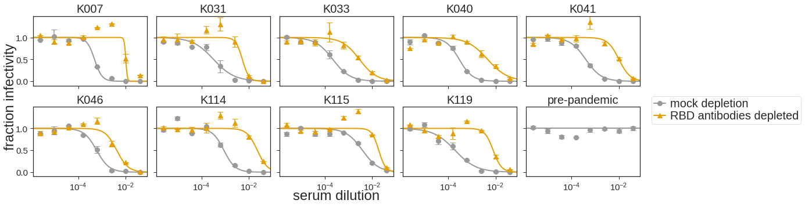
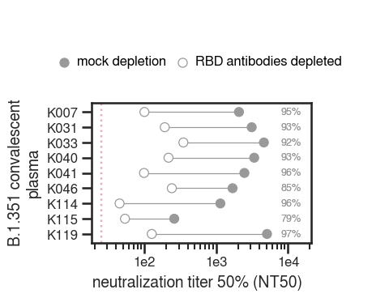
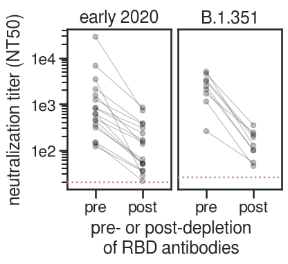
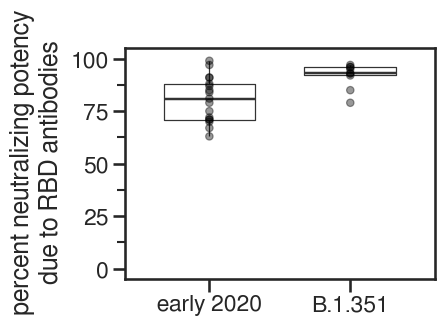

# Determine the amount of neutralizing activity directed towards the RBD elicited by infection with B.1.351

## Set up analysis
Import packages


```python
import os
import re
import warnings

from IPython.display import display, HTML

import matplotlib
from matplotlib.backends.backend_pdf import PdfPages
import matplotlib as mpl
import matplotlib.pyplot as plt
import natsort

import numpy as np
import pandas as pd
from plotnine import *
import seaborn

import neutcurve
from neutcurve.colorschemes import CBMARKERS, CBPALETTE
import seaborn

import lifelines
import sklearn
import scipy.stats

import yaml

print(f"Using `neutcurve` version {neutcurve.__version__}")
```

    Using `neutcurve` version 0.5.7


Use seaborn theme and change font:


```python
theme_set(theme_seaborn(style='white', context='talk', font='FreeSans', font_scale=1))
plt.style.use('seaborn-white')
```

Read in config file


```python
with open('config.yaml') as f:
    config = yaml.safe_load(f)
```

Define results directory


```python
resultsdir = 'results/rbd_depletion_neuts'
os.makedirs(resultsdir, exist_ok=True)
```

## Read in fracinfect file and plot curves

Read in the neut data for all experiments for this paper, but only select the date(s) that correspond to the RBD depletions experiment. Note that this is only configured to handle one experiment date currently (because the amazingly talented Rachel Eguia ran all these assays on a single date). So for future projects, this might need to be adjusted. 


```python
rbd_depletions_date = str(config['rbd_depletions_date'])
print(f'Getting data from {rbd_depletions_date}')

frac_infect = (pd.read_csv(config['aggregate_fract_infect_csvs'])
               .query('date==@rbd_depletions_date')
               .replace({'mock': 'mock depletion'})
              )

fits = neutcurve.CurveFits(frac_infect)

fitparams = (
    fits.fitParams()
    .rename(columns={'virus': 'depletion', 'wildtype':'mock depletion'})
    # get columns of interest
    [['serum', 'depletion', 'ic50', 'ic50_bound']]
    .assign(NT50=lambda x: 1/x['ic50'])
    )

# couldn't get lambda / conditional statement to work with assign, so try it here:
fitparams['ic50_is_bound'] = fitparams['ic50_bound'].apply(lambda x: True if x!='interpolated' else False)

display(HTML(fitparams.to_html(index=False)))
```

    Getting data from 2021-06-10


    /fh/fast/bloom_j/software/miniconda3/envs/BloomLab/lib/python3.8/site-packages/neutcurve/hillcurve.py:741: RuntimeWarning: invalid value encountered in power


<table border="1" class="dataframe">
  <thead>
    <tr style="text-align: right;">
      <th>serum</th>
      <th>depletion</th>
      <th>ic50</th>
      <th>ic50_bound</th>
      <th>NT50</th>
      <th>ic50_is_bound</th>
    </tr>
  </thead>
  <tbody>
    <tr>
      <td>pre-pandemic</td>
      <td>mock depletion</td>
      <td>0.040000</td>
      <td>lower</td>
      <td>25.000000</td>
      <td>True</td>
    </tr>
    <tr>
      <td>K006</td>
      <td>mock depletion</td>
      <td>0.040000</td>
      <td>lower</td>
      <td>25.000000</td>
      <td>True</td>
    </tr>
    <tr>
      <td>K119</td>
      <td>mock depletion</td>
      <td>0.000197</td>
      <td>interpolated</td>
      <td>5081.755209</td>
      <td>False</td>
    </tr>
    <tr>
      <td>K119</td>
      <td>RBD antibodies depleted</td>
      <td>0.007951</td>
      <td>interpolated</td>
      <td>125.772359</td>
      <td>False</td>
    </tr>
    <tr>
      <td>K116</td>
      <td>mock depletion</td>
      <td>0.040000</td>
      <td>lower</td>
      <td>25.000000</td>
      <td>True</td>
    </tr>
    <tr>
      <td>K116</td>
      <td>RBD antibodies depleted</td>
      <td>0.040000</td>
      <td>lower</td>
      <td>25.000000</td>
      <td>True</td>
    </tr>
    <tr>
      <td>REGN10987 (spike-in)</td>
      <td>mock depletion</td>
      <td>0.006938</td>
      <td>interpolated</td>
      <td>144.127658</td>
      <td>False</td>
    </tr>
    <tr>
      <td>REGN10987 (spike-in)</td>
      <td>RBD antibodies depleted</td>
      <td>0.250000</td>
      <td>lower</td>
      <td>4.000000</td>
      <td>True</td>
    </tr>
    <tr>
      <td>K114</td>
      <td>mock depletion</td>
      <td>0.000879</td>
      <td>interpolated</td>
      <td>1138.078550</td>
      <td>False</td>
    </tr>
    <tr>
      <td>K114</td>
      <td>RBD antibodies depleted</td>
      <td>0.022327</td>
      <td>interpolated</td>
      <td>44.788025</td>
      <td>False</td>
    </tr>
    <tr>
      <td>K115</td>
      <td>mock depletion</td>
      <td>0.003863</td>
      <td>interpolated</td>
      <td>258.856367</td>
      <td>False</td>
    </tr>
    <tr>
      <td>K115</td>
      <td>RBD antibodies depleted</td>
      <td>0.018773</td>
      <td>interpolated</td>
      <td>53.266737</td>
      <td>False</td>
    </tr>
    <tr>
      <td>K041</td>
      <td>mock depletion</td>
      <td>0.000407</td>
      <td>interpolated</td>
      <td>2459.294005</td>
      <td>False</td>
    </tr>
    <tr>
      <td>K041</td>
      <td>RBD antibodies depleted</td>
      <td>0.010180</td>
      <td>interpolated</td>
      <td>98.231227</td>
      <td>False</td>
    </tr>
    <tr>
      <td>K046</td>
      <td>mock depletion</td>
      <td>0.000594</td>
      <td>interpolated</td>
      <td>1683.435561</td>
      <td>False</td>
    </tr>
    <tr>
      <td>K046</td>
      <td>RBD antibodies depleted</td>
      <td>0.004173</td>
      <td>interpolated</td>
      <td>239.660236</td>
      <td>False</td>
    </tr>
    <tr>
      <td>K033</td>
      <td>mock depletion</td>
      <td>0.000217</td>
      <td>interpolated</td>
      <td>4600.806832</td>
      <td>False</td>
    </tr>
    <tr>
      <td>K033</td>
      <td>RBD antibodies depleted</td>
      <td>0.002881</td>
      <td>interpolated</td>
      <td>347.054493</td>
      <td>False</td>
    </tr>
    <tr>
      <td>K040</td>
      <td>mock depletion</td>
      <td>0.000297</td>
      <td>interpolated</td>
      <td>3369.006960</td>
      <td>False</td>
    </tr>
    <tr>
      <td>K040</td>
      <td>RBD antibodies depleted</td>
      <td>0.004643</td>
      <td>interpolated</td>
      <td>215.377504</td>
      <td>False</td>
    </tr>
    <tr>
      <td>K007</td>
      <td>mock depletion</td>
      <td>0.000484</td>
      <td>interpolated</td>
      <td>2067.627899</td>
      <td>False</td>
    </tr>
    <tr>
      <td>K007</td>
      <td>RBD antibodies depleted</td>
      <td>0.010060</td>
      <td>interpolated</td>
      <td>99.401766</td>
      <td>False</td>
    </tr>
    <tr>
      <td>K031</td>
      <td>mock depletion</td>
      <td>0.000322</td>
      <td>interpolated</td>
      <td>3108.634600</td>
      <td>False</td>
    </tr>
    <tr>
      <td>K031</td>
      <td>RBD antibodies depleted</td>
      <td>0.005240</td>
      <td>interpolated</td>
      <td>190.852692</td>
      <td>False</td>
    </tr>
  </tbody>
</table>


```python
non_neut=["REGN10987 (spike-in)", "K006", "K116"]

fig, axes = fits.plotSera(sera=natsort.natsorted(fitparams.query('serum not in @non_neut')['serum'].unique()),
                          xlabel='serum dilution',
                          ncol=5,
                          widthscale=1,
                          heightscale=1,
                          titlesize=20, labelsize=24, ticksize=15, legendfontsize=20, yticklocs=[0,0.5,1],
                          markersize=8, linewidth=2,
                         )

plotfile = PdfPages(f'{resultsdir}/sera_frac_infectivity.pdf')
plotfile.savefig(bbox_inches='tight', transparent=True)
plotfile.close()
```





```python
fig, axes = fits.plotSera(sera=natsort.natsorted(fitparams.query('serum=="REGN10987 (spike-in)"')['serum'].unique()),
                          xlabel='antibody (ug/uL)',
                          yticklocs=[0,0.5,1],
                          markersize=8, linewidth=2,
                         )

plotfile = PdfPages(f'{resultsdir}/REGN10987_frac_infectivity.pdf')
plotfile.savefig(bbox_inches='tight', transparent=True)
plotfile.close()
```


```python
# define which sera to exclude from downstream analyses
exclude_sera = ["pre-pandemic", "REGN10987 (spike-in)", "K006", "K116"]
```


```python
foldchange = (
    fitparams
    .query('serum not in @exclude_sera')
    .pivot_table(values='ic50', index=['serum'], columns=['depletion'])
    .reset_index()
    .rename(columns={'RBD antibodies depleted': 'post-depletion_ic50', 'mock depletion': 'pre-depletion_ic50'})
    .assign(fold_change=lambda x: x['post-depletion_ic50'] / x['pre-depletion_ic50'],
            percent_RBD= lambda x: ((1-1/x['fold_change'])*100).astype(int),
            NT50_pre=lambda x: 1/x['pre-depletion_ic50'],
            NT50_post=lambda x: 1/x['post-depletion_ic50'],
           )
    .merge(fitparams.query('depletion=="RBD antibodies depleted"')[['serum', 'ic50_is_bound']], on='serum')
    .assign(perc_RBD_str = lambda x: x['percent_RBD'].astype(str)
           )
    .rename(columns={'ic50_is_bound': 'post_ic50_bound'})
    .merge(fitparams)
    .assign(depletion=lambda x: pd.Categorical(x['depletion'], categories=['mock depletion', 'RBD antibodies depleted'], ordered=True))
    )

foldchange['perc_RBD_str'] = np.where(foldchange['post_ic50_bound'], '>'+foldchange['perc_RBD_str']+'%', foldchange['perc_RBD_str']+'%')
display(HTML(foldchange.head(10).to_html(index=False)))
```


<table border="1" class="dataframe">
  <thead>
    <tr style="text-align: right;">
      <th>serum</th>
      <th>post-depletion_ic50</th>
      <th>pre-depletion_ic50</th>
      <th>fold_change</th>
      <th>percent_RBD</th>
      <th>NT50_pre</th>
      <th>NT50_post</th>
      <th>post_ic50_bound</th>
      <th>perc_RBD_str</th>
      <th>depletion</th>
      <th>ic50</th>
      <th>ic50_bound</th>
      <th>NT50</th>
      <th>ic50_is_bound</th>
    </tr>
  </thead>
  <tbody>
    <tr>
      <td>K007</td>
      <td>0.010060</td>
      <td>0.000484</td>
      <td>20.800716</td>
      <td>95</td>
      <td>2067.627899</td>
      <td>99.401766</td>
      <td>False</td>
      <td>95%</td>
      <td>mock depletion</td>
      <td>0.000484</td>
      <td>interpolated</td>
      <td>2067.627899</td>
      <td>False</td>
    </tr>
    <tr>
      <td>K007</td>
      <td>0.010060</td>
      <td>0.000484</td>
      <td>20.800716</td>
      <td>95</td>
      <td>2067.627899</td>
      <td>99.401766</td>
      <td>False</td>
      <td>95%</td>
      <td>RBD antibodies depleted</td>
      <td>0.010060</td>
      <td>interpolated</td>
      <td>99.401766</td>
      <td>False</td>
    </tr>
    <tr>
      <td>K031</td>
      <td>0.005240</td>
      <td>0.000322</td>
      <td>16.288136</td>
      <td>93</td>
      <td>3108.634600</td>
      <td>190.852692</td>
      <td>False</td>
      <td>93%</td>
      <td>mock depletion</td>
      <td>0.000322</td>
      <td>interpolated</td>
      <td>3108.634600</td>
      <td>False</td>
    </tr>
    <tr>
      <td>K031</td>
      <td>0.005240</td>
      <td>0.000322</td>
      <td>16.288136</td>
      <td>93</td>
      <td>3108.634600</td>
      <td>190.852692</td>
      <td>False</td>
      <td>93%</td>
      <td>RBD antibodies depleted</td>
      <td>0.005240</td>
      <td>interpolated</td>
      <td>190.852692</td>
      <td>False</td>
    </tr>
    <tr>
      <td>K033</td>
      <td>0.002881</td>
      <td>0.000217</td>
      <td>13.256727</td>
      <td>92</td>
      <td>4600.806832</td>
      <td>347.054493</td>
      <td>False</td>
      <td>92%</td>
      <td>mock depletion</td>
      <td>0.000217</td>
      <td>interpolated</td>
      <td>4600.806832</td>
      <td>False</td>
    </tr>
    <tr>
      <td>K033</td>
      <td>0.002881</td>
      <td>0.000217</td>
      <td>13.256727</td>
      <td>92</td>
      <td>4600.806832</td>
      <td>347.054493</td>
      <td>False</td>
      <td>92%</td>
      <td>RBD antibodies depleted</td>
      <td>0.002881</td>
      <td>interpolated</td>
      <td>347.054493</td>
      <td>False</td>
    </tr>
    <tr>
      <td>K040</td>
      <td>0.004643</td>
      <td>0.000297</td>
      <td>15.642334</td>
      <td>93</td>
      <td>3369.006960</td>
      <td>215.377504</td>
      <td>False</td>
      <td>93%</td>
      <td>mock depletion</td>
      <td>0.000297</td>
      <td>interpolated</td>
      <td>3369.006960</td>
      <td>False</td>
    </tr>
    <tr>
      <td>K040</td>
      <td>0.004643</td>
      <td>0.000297</td>
      <td>15.642334</td>
      <td>93</td>
      <td>3369.006960</td>
      <td>215.377504</td>
      <td>False</td>
      <td>93%</td>
      <td>RBD antibodies depleted</td>
      <td>0.004643</td>
      <td>interpolated</td>
      <td>215.377504</td>
      <td>False</td>
    </tr>
    <tr>
      <td>K041</td>
      <td>0.010180</td>
      <td>0.000407</td>
      <td>25.035766</td>
      <td>96</td>
      <td>2459.294005</td>
      <td>98.231227</td>
      <td>False</td>
      <td>96%</td>
      <td>mock depletion</td>
      <td>0.000407</td>
      <td>interpolated</td>
      <td>2459.294005</td>
      <td>False</td>
    </tr>
    <tr>
      <td>K041</td>
      <td>0.010180</td>
      <td>0.000407</td>
      <td>25.035766</td>
      <td>96</td>
      <td>2459.294005</td>
      <td>98.231227</td>
      <td>False</td>
      <td>96%</td>
      <td>RBD antibodies depleted</td>
      <td>0.010180</td>
      <td>interpolated</td>
      <td>98.231227</td>
      <td>False</td>
    </tr>
  </tbody>
</table>


```python
p = (ggplot(foldchange
            .assign(
                    serum=lambda x: pd.Categorical(x['serum'], natsort.natsorted(x['serum'].unique())[::-1], ordered=True)
                   )
            , 
            aes(x='NT50',
                y='serum',
                fill='depletion',
                group='serum',
                label='perc_RBD_str'
               )) +
     scale_x_log10(name='neutralization titer 50% (NT50)', 
                   limits=[25,foldchange['NT50'].max()*3]) +
     geom_vline(xintercept=25, 
                linetype='dotted', 
                size=1, 
                alpha=0.6, 
                color=CBPALETTE[7]) +
     geom_line(alpha=1, color=CBPALETTE[0]) +
     geom_point(size=4, color=CBPALETTE[0]) +
     geom_text(aes(x=foldchange['NT50'].max()*3, y='serum'), #
               color=CBPALETTE[0],
               ha='right',
               size=9,
              ) +
     theme(figure_size=(3.5,0.25*foldchange['serum'].nunique()),
           axis_text=element_text(size=12),
           legend_text=element_text(size=12),
           legend_title=element_text(size=12),
           axis_title_x=element_text(size=12),
          ) +
     ylab('') +
     scale_fill_manual(values=['#999999', '#FFFFFF', ], 
                       name='depletion of RBD antibodies')
    )

_ = p.draw()

p.save(f'{resultsdir}/NT50_trackplot.pdf')
```

    /fh/fast/bloom_j/software/miniconda3/envs/BloomLab/lib/python3.8/site-packages/plotnine/ggplot.py:727: PlotnineWarning: Saving 3.5 x 2.25 in image.
    /fh/fast/bloom_j/software/miniconda3/envs/BloomLab/lib/python3.8/site-packages/plotnine/ggplot.py:730: PlotnineWarning: Filename: results/rbd_depletion_neuts/NT50_trackplot.pdf





```python
# Assign days post symptom onset for samples:
collection_day={
'K007':40,
'K031':34,
'K033':35,
'K040':37,
'K041':30,
'K046':33,
'K114':31,
'K115':27,
'K116':34,
'K119':29,
}

foldchange=foldchange.assign(day=lambda x: x['serum'].map(collection_day))
```


```python
conv_plasma = (pd.read_csv('data/haarvi_rbd_depletion_foldchange_ic50.csv')
               [['serum', 'depletion', 'NT50', 'fold_change',  'percent_RBD', 'Days Post-Symptom Onset', 'post_ic50_bound']]
               .rename(columns={'Days Post-Symptom Onset':'day'})
               .assign(sample_type='Wuhan-1-like')
               .query('serum!="participant A (day 45)"') # dropping subject A (day 45) because we will only use the first time point
              )

compare_df = (pd.concat([conv_plasma, 
                        (foldchange[['serum', 'depletion', 'NT50', 'fold_change', 'percent_RBD', 'day', 'post_ic50_bound']]
                         .assign(sample_type='B.1.351'))
                       ],
                       ignore_index=True
                      )
              .replace({'pre-depletion': 'pre', 'post-depletion':'post', 'mock depletion': 'pre', 'RBD antibodies depleted': 'post'})
              .assign(depletion=lambda x: pd.Categorical(x['depletion'], categories=['pre', 'post'], ordered=True), 
                      sample_type=lambda x: pd.Categorical(x['sample_type'], categories=['Wuhan-1-like', 'B.1.351'], ordered=True),
                      early_late=lambda x: x['day'].apply(lambda x: 'day 30-60' if x<=61 else 'day 100-150'),
                     )
              .assign(early_late=lambda x: pd.Categorical(x['early_late'], categories=['day 30-60', 'day 100-150'], ordered=True),)
             )
               
display(HTML(compare_df.head().to_html(index=False))) 

csvfile=f'{resultsdir}/RBD_depletion_NT50_b1351_haarvi.csv'
print(f'Writing to {csvfile}')
compare_df.to_csv(csvfile, index=False)
```


<table border="1" class="dataframe">
  <thead>
    <tr style="text-align: right;">
      <th>serum</th>
      <th>depletion</th>
      <th>NT50</th>
      <th>fold_change</th>
      <th>percent_RBD</th>
      <th>day</th>
      <th>post_ic50_bound</th>
      <th>sample_type</th>
      <th>early_late</th>
    </tr>
  </thead>
  <tbody>
    <tr>
      <td>participant A (day 120)</td>
      <td>pre</td>
      <td>861.163942</td>
      <td>43.058197</td>
      <td>97</td>
      <td>120</td>
      <td>True</td>
      <td>Wuhan-1-like</td>
      <td>day 100-150</td>
    </tr>
    <tr>
      <td>participant A (day 120)</td>
      <td>post</td>
      <td>20.000000</td>
      <td>43.058197</td>
      <td>97</td>
      <td>120</td>
      <td>True</td>
      <td>Wuhan-1-like</td>
      <td>day 100-150</td>
    </tr>
    <tr>
      <td>participant A (day 21)</td>
      <td>pre</td>
      <td>6881.224570</td>
      <td>8.142050</td>
      <td>87</td>
      <td>21</td>
      <td>False</td>
      <td>Wuhan-1-like</td>
      <td>day 30-60</td>
    </tr>
    <tr>
      <td>participant A (day 21)</td>
      <td>post</td>
      <td>845.146407</td>
      <td>8.142050</td>
      <td>87</td>
      <td>21</td>
      <td>False</td>
      <td>Wuhan-1-like</td>
      <td>day 30-60</td>
    </tr>
    <tr>
      <td>participant B (day 113)</td>
      <td>pre</td>
      <td>284.860372</td>
      <td>14.243019</td>
      <td>92</td>
      <td>113</td>
      <td>True</td>
      <td>Wuhan-1-like</td>
      <td>day 100-150</td>
    </tr>
  </tbody>
</table>


    Writing to results/rbd_depletion_neuts/RBD_depletion_NT50_b1351_haarvi.csv


```python
LOD = (pd.DataFrame(data={'sample_type': ['Wuhan-1-like', 'B.1.351'], 'NT50': [20, 25]})
      .assign(sample_type=lambda x: pd.Categorical(x['sample_type'], categories=['Wuhan-1-like', 'B.1.351'], ordered=True))
      )

NT50_lines = (ggplot(compare_df.query("early_late=='day 30-60'"), aes(x='depletion', y='NT50', group='serum')) + 
              geom_point(size=2.5, alpha=0.25) +
              geom_line(alpha=0.25) +
              facet_wrap('~sample_type') +
              theme(axis_title_y=element_text(margin={'r': 6}),
                    strip_background=element_blank(),
                    figure_size=(4, 3),) +
              scale_y_log10(name='neutralization titer (NT50)') +
              xlab('pre- or post-depletion\nof RBD antibodies') +
              geom_hline(data=LOD,
                             mapping=aes(yintercept='NT50'),
                             color=CBPALETTE[7],
                             alpha=1,
                             size=1,
                             linetype='dotted',
                            )
                 )

_ = NT50_lines.draw()
NT50_lines.save(f'{resultsdir}/compare_Wuhan1_B1351_RBDtargeting.pdf')
```

    /fh/fast/bloom_j/software/miniconda3/envs/BloomLab/lib/python3.8/site-packages/plotnine/ggplot.py:727: PlotnineWarning: Saving 4 x 3 in image.
    /fh/fast/bloom_j/software/miniconda3/envs/BloomLab/lib/python3.8/site-packages/plotnine/ggplot.py:730: PlotnineWarning: Filename: results/rbd_depletion_neuts/compare_Wuhan1_B1351_RBDtargeting.pdf





```python
p = (ggplot((compare_df.query("early_late=='day 30-60'").drop(columns=['depletion', 'NT50']).drop_duplicates())
           ) +
     aes('sample_type', 'percent_RBD') +
     geom_boxplot(width=0.65,
                  position=position_dodge(width=0.7),
                  outlier_shape='') +
     geom_jitter(position=position_dodge(width=0.7),
                 alpha=0.4, size=2.5) +
     theme(figure_size=(4, 3),
           strip_background=element_blank()
           ) +
     scale_y_continuous(limits=[0, 100]) +
     ylab('percent neutralizing potency\ndue to RBD antibodies') +
     xlab ('')
     )

_ = p.draw()
p.save(f'{resultsdir}/compare_percentRBD.pdf')
```

    /fh/fast/bloom_j/software/miniconda3/envs/BloomLab/lib/python3.8/site-packages/plotnine/ggplot.py:727: PlotnineWarning: Saving 4 x 3 in image.
    /fh/fast/bloom_j/software/miniconda3/envs/BloomLab/lib/python3.8/site-packages/plotnine/ggplot.py:730: PlotnineWarning: Filename: results/rbd_depletion_neuts/compare_percentRBD.pdf





```python
stat_test_df = (compare_df
                .query("early_late=='day 30-60'")
                [['serum', 'sample_type', 'fold_change', 'percent_RBD', 'post_ic50_bound']]
                .drop_duplicates()
               )
# display(HTML(stat_test_df.to_html()))

print(f"Comparing Wuhan-1-like to B.1.351")
percent_1 = stat_test_df.query('sample_type == "Wuhan-1-like"')['percent_RBD']
percent_2 = stat_test_df.query('sample_type == "B.1.351"')['percent_RBD']
u, p = scipy.stats.mannwhitneyu(percent_1, percent_2)
print(f"  Mann-Whitney test:      P = {p:.2g}")
res = lifelines.statistics.logrank_test(percent_1, percent_2)
print(f"  Log-rank test:          P = {res.p_value:.2g}")
censored_1 = (~stat_test_df.query('sample_type == "Wuhan-1-like"')['post_ic50_bound']).astype(int)
censored_2 = (~stat_test_df.query('sample_type == "B.1.351"')['post_ic50_bound']).astype(int)
res = lifelines.statistics.logrank_test(percent_1, percent_2, censored_1, censored_2)
print(f"  Log-rank test censored: P = {res.p_value:.2g}")
# actually, Cox regression is recommended over log-rank test, see here:
# https://lifelines.readthedocs.io/en/latest/lifelines.statistics.html
cox_df = pd.concat([
        pd.DataFrame({'E': censored_1, 'T': percent_1, 'groupA': 1}),
        pd.DataFrame({'E': censored_2, 'T': percent_2, 'groupA': 0})
        ])
cph = lifelines.CoxPHFitter().fit(cox_df, 'T', 'E')
print(f"  Cox proportional-hazards censored: P = {cph.summary.at['groupA', 'p']:.2g}")
```

    Comparing Wuhan-1-like to B.1.351
      Mann-Whitney test:      P = 0.0061
      Log-rank test:          P = 0.087
      Log-rank test censored: P = 0.087
      Cox proportional-hazards censored: P = 0.12


```python

```
