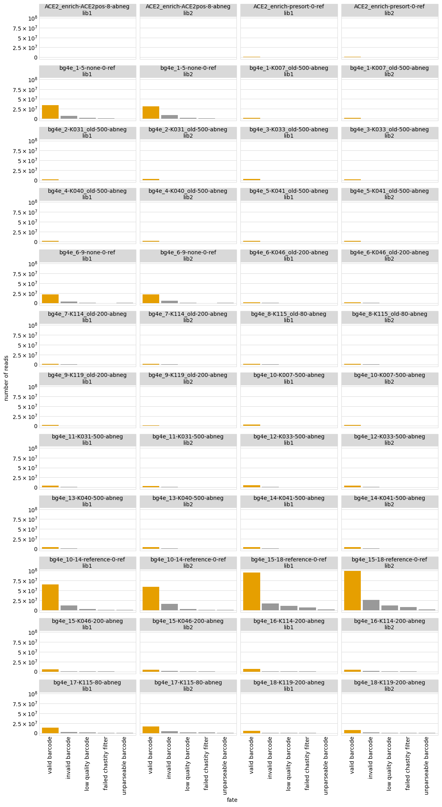

# Aggregate variant counts for all samples
Separate `Snakemake` rules count the observations of each variant in each sample from the Illumina barcode sequencing.
This Python Jupyter notebook aggregates all of this counts, and then adds them to a codon variant table.

## Set up analysis
### Import Python modules.
Use [plotnine](https://plotnine.readthedocs.io/en/stable/) for ggplot2-like plotting.

The analysis relies heavily on the Bloom lab's [dms_variants](https://jbloomlab.github.io/dms_variants) package:


```python
import glob
import itertools
import math
import os
import warnings

import Bio.SeqIO

import dms_variants.codonvarianttable
from dms_variants.constants import CBPALETTE
import dms_variants.utils
import dms_variants.plotnine_themes

from IPython.display import display, HTML

import pandas as pd

from plotnine import *

import yaml
```

Set [plotnine](https://plotnine.readthedocs.io/en/stable/) theme to the gray-grid one defined in `dms_variants`:


```python
theme_set(dms_variants.plotnine_themes.theme_graygrid())
```

Versions of key software:


```python
print(f"Using dms_variants version {dms_variants.__version__}")
```

    Using dms_variants version 0.8.9


Ignore warnings that clutter output:


```python
warnings.simplefilter('ignore')
```

Read the configuration file:


```python
with open('config.yaml') as f:
    config = yaml.safe_load(f)
```

Make output directory if needed:


```python
os.makedirs(config['counts_dir'], exist_ok=True)
```

## Initialize codon variant table
Initialize the [CodonVariantTable](https://jbloomlab.github.io/dms_variants/dms_variants.codonvarianttable.html#dms_variants.codonvarianttable.CodonVariantTable) using the wildtype gene sequence and the CSV file with the table of variants:


```python
wt_seqrecord = Bio.SeqIO.read(config['wildtype_sequence'], 'fasta')
geneseq = str(wt_seqrecord.seq)
primary_target = wt_seqrecord.name
print(f"Read sequence of {len(geneseq)} nt for {primary_target} from {config['wildtype_sequence']}")
      
print(f"Initializing CodonVariantTable from gene sequence and {config['codon_variant_table']}")
      
variants = dms_variants.codonvarianttable.CodonVariantTable(
                geneseq=geneseq,
                barcode_variant_file=config['codon_variant_table'],
                substitutions_are_codon=True,
                substitutions_col='codon_substitutions',
                primary_target=primary_target)
```

    Read sequence of 603 nt for B1351 from data/wildtype_sequence.fasta
    Initializing CodonVariantTable from gene sequence and results/variants/codon_variant_table.csv


## Read barcode counts / fates
Read data frame with list of all samples (barcode runs):


```python
print(f"Reading list of barcode runs from {config['barcode_runs']}")

barcode_runs = (pd.read_csv(config['barcode_runs'])
                .assign(sample_lib=lambda x: x['sample'] + '_' + x['library'],
                        counts_file=lambda x: config['counts_dir'] + '/' + x['sample_lib'] + '_counts.csv',
                        fates_file=lambda x: config['counts_dir'] + '/' + x['sample_lib'] + '_fates.csv',
                        )
                .drop(columns='R1')  # don't need this column, and very large
                )

assert all(map(os.path.isfile, barcode_runs['counts_file'])), 'missing some counts files'
assert all(map(os.path.isfile, barcode_runs['fates_file'])), 'missing some fates files'

display(HTML(barcode_runs.to_html(index=False)))
```

    Reading list of barcode runs from data/barcode_runs.csv


<table border="1" class="dataframe">
  <thead>
    <tr style="text-align: right;">
      <th>date</th>
      <th>experiment</th>
      <th>library</th>
      <th>antibody</th>
      <th>concentration</th>
      <th>sort_bin</th>
      <th>selection</th>
      <th>sample</th>
      <th>experiment_type</th>
      <th>number_cells</th>
      <th>frac_escape</th>
      <th>sample_lib</th>
      <th>counts_file</th>
      <th>fates_file</th>
    </tr>
  </thead>
  <tbody>
    <tr>
      <td>210603</td>
      <td>ACE2_enrich</td>
      <td>lib1</td>
      <td>ACE2pos</td>
      <td>8</td>
      <td>abneg</td>
      <td>escape</td>
      <td>ACE2_enrich-ACE2pos-8-abneg</td>
      <td>ab_selection</td>
      <td>31118467.0</td>
      <td>0.900</td>
      <td>ACE2_enrich-ACE2pos-8-abneg_lib1</td>
      <td>results/counts/ACE2_enrich-ACE2pos-8-abneg_lib1_counts.csv</td>
      <td>results/counts/ACE2_enrich-ACE2pos-8-abneg_lib1_fates.csv</td>
    </tr>
    <tr>
      <td>210603</td>
      <td>ACE2_enrich</td>
      <td>lib2</td>
      <td>ACE2pos</td>
      <td>8</td>
      <td>abneg</td>
      <td>escape</td>
      <td>ACE2_enrich-ACE2pos-8-abneg</td>
      <td>ab_selection</td>
      <td>32008380.0</td>
      <td>0.900</td>
      <td>ACE2_enrich-ACE2pos-8-abneg_lib2</td>
      <td>results/counts/ACE2_enrich-ACE2pos-8-abneg_lib2_counts.csv</td>
      <td>results/counts/ACE2_enrich-ACE2pos-8-abneg_lib2_fates.csv</td>
    </tr>
    <tr>
      <td>210603</td>
      <td>ACE2_enrich</td>
      <td>lib1</td>
      <td>presort</td>
      <td>0</td>
      <td>ref</td>
      <td>reference</td>
      <td>ACE2_enrich-presort-0-ref</td>
      <td>ab_selection</td>
      <td>NaN</td>
      <td>NaN</td>
      <td>ACE2_enrich-presort-0-ref_lib1</td>
      <td>results/counts/ACE2_enrich-presort-0-ref_lib1_counts.csv</td>
      <td>results/counts/ACE2_enrich-presort-0-ref_lib1_fates.csv</td>
    </tr>
    <tr>
      <td>210603</td>
      <td>ACE2_enrich</td>
      <td>lib2</td>
      <td>presort</td>
      <td>0</td>
      <td>ref</td>
      <td>reference</td>
      <td>ACE2_enrich-presort-0-ref</td>
      <td>ab_selection</td>
      <td>NaN</td>
      <td>NaN</td>
      <td>ACE2_enrich-presort-0-ref_lib2</td>
      <td>results/counts/ACE2_enrich-presort-0-ref_lib2_counts.csv</td>
      <td>results/counts/ACE2_enrich-presort-0-ref_lib2_fates.csv</td>
    </tr>
    <tr>
      <td>210616</td>
      <td>bg4e_1-5</td>
      <td>lib1</td>
      <td>none</td>
      <td>0</td>
      <td>ref</td>
      <td>reference</td>
      <td>bg4e_1-5-none-0-ref</td>
      <td>ab_selection</td>
      <td>NaN</td>
      <td>NaN</td>
      <td>bg4e_1-5-none-0-ref_lib1</td>
      <td>results/counts/bg4e_1-5-none-0-ref_lib1_counts.csv</td>
      <td>results/counts/bg4e_1-5-none-0-ref_lib1_fates.csv</td>
    </tr>
    <tr>
      <td>210616</td>
      <td>bg4e_1-5</td>
      <td>lib2</td>
      <td>none</td>
      <td>0</td>
      <td>ref</td>
      <td>reference</td>
      <td>bg4e_1-5-none-0-ref</td>
      <td>ab_selection</td>
      <td>NaN</td>
      <td>NaN</td>
      <td>bg4e_1-5-none-0-ref_lib2</td>
      <td>results/counts/bg4e_1-5-none-0-ref_lib2_counts.csv</td>
      <td>results/counts/bg4e_1-5-none-0-ref_lib2_fates.csv</td>
    </tr>
    <tr>
      <td>210616</td>
      <td>bg4e_1</td>
      <td>lib1</td>
      <td>K007_old</td>
      <td>500</td>
      <td>abneg</td>
      <td>escape</td>
      <td>bg4e_1-K007_old-500-abneg</td>
      <td>ab_selection</td>
      <td>527450.0</td>
      <td>0.051</td>
      <td>bg4e_1-K007_old-500-abneg_lib1</td>
      <td>results/counts/bg4e_1-K007_old-500-abneg_lib1_counts.csv</td>
      <td>results/counts/bg4e_1-K007_old-500-abneg_lib1_fates.csv</td>
    </tr>
    <tr>
      <td>210616</td>
      <td>bg4e_1</td>
      <td>lib2</td>
      <td>K007_old</td>
      <td>500</td>
      <td>abneg</td>
      <td>escape</td>
      <td>bg4e_1-K007_old-500-abneg</td>
      <td>ab_selection</td>
      <td>601342.0</td>
      <td>0.065</td>
      <td>bg4e_1-K007_old-500-abneg_lib2</td>
      <td>results/counts/bg4e_1-K007_old-500-abneg_lib2_counts.csv</td>
      <td>results/counts/bg4e_1-K007_old-500-abneg_lib2_fates.csv</td>
    </tr>
    <tr>
      <td>210616</td>
      <td>bg4e_2</td>
      <td>lib1</td>
      <td>K031_old</td>
      <td>500</td>
      <td>abneg</td>
      <td>escape</td>
      <td>bg4e_2-K031_old-500-abneg</td>
      <td>ab_selection</td>
      <td>524121.0</td>
      <td>0.044</td>
      <td>bg4e_2-K031_old-500-abneg_lib1</td>
      <td>results/counts/bg4e_2-K031_old-500-abneg_lib1_counts.csv</td>
      <td>results/counts/bg4e_2-K031_old-500-abneg_lib1_fates.csv</td>
    </tr>
    <tr>
      <td>210616</td>
      <td>bg4e_2</td>
      <td>lib2</td>
      <td>K031_old</td>
      <td>500</td>
      <td>abneg</td>
      <td>escape</td>
      <td>bg4e_2-K031_old-500-abneg</td>
      <td>ab_selection</td>
      <td>609250.0</td>
      <td>0.058</td>
      <td>bg4e_2-K031_old-500-abneg_lib2</td>
      <td>results/counts/bg4e_2-K031_old-500-abneg_lib2_counts.csv</td>
      <td>results/counts/bg4e_2-K031_old-500-abneg_lib2_fates.csv</td>
    </tr>
    <tr>
      <td>210616</td>
      <td>bg4e_3</td>
      <td>lib1</td>
      <td>K033_old</td>
      <td>500</td>
      <td>abneg</td>
      <td>escape</td>
      <td>bg4e_3-K033_old-500-abneg</td>
      <td>ab_selection</td>
      <td>752288.0</td>
      <td>0.067</td>
      <td>bg4e_3-K033_old-500-abneg_lib1</td>
      <td>results/counts/bg4e_3-K033_old-500-abneg_lib1_counts.csv</td>
      <td>results/counts/bg4e_3-K033_old-500-abneg_lib1_fates.csv</td>
    </tr>
    <tr>
      <td>210616</td>
      <td>bg4e_3</td>
      <td>lib2</td>
      <td>K033_old</td>
      <td>500</td>
      <td>abneg</td>
      <td>escape</td>
      <td>bg4e_3-K033_old-500-abneg</td>
      <td>ab_selection</td>
      <td>532827.0</td>
      <td>0.083</td>
      <td>bg4e_3-K033_old-500-abneg_lib2</td>
      <td>results/counts/bg4e_3-K033_old-500-abneg_lib2_counts.csv</td>
      <td>results/counts/bg4e_3-K033_old-500-abneg_lib2_fates.csv</td>
    </tr>
    <tr>
      <td>210616</td>
      <td>bg4e_4</td>
      <td>lib1</td>
      <td>K040_old</td>
      <td>500</td>
      <td>abneg</td>
      <td>escape</td>
      <td>bg4e_4-K040_old-500-abneg</td>
      <td>ab_selection</td>
      <td>481061.0</td>
      <td>0.046</td>
      <td>bg4e_4-K040_old-500-abneg_lib1</td>
      <td>results/counts/bg4e_4-K040_old-500-abneg_lib1_counts.csv</td>
      <td>results/counts/bg4e_4-K040_old-500-abneg_lib1_fates.csv</td>
    </tr>
    <tr>
      <td>210616</td>
      <td>bg4e_4</td>
      <td>lib2</td>
      <td>K040_old</td>
      <td>500</td>
      <td>abneg</td>
      <td>escape</td>
      <td>bg4e_4-K040_old-500-abneg</td>
      <td>ab_selection</td>
      <td>616299.0</td>
      <td>0.067</td>
      <td>bg4e_4-K040_old-500-abneg_lib2</td>
      <td>results/counts/bg4e_4-K040_old-500-abneg_lib2_counts.csv</td>
      <td>results/counts/bg4e_4-K040_old-500-abneg_lib2_fates.csv</td>
    </tr>
    <tr>
      <td>210616</td>
      <td>bg4e_5</td>
      <td>lib1</td>
      <td>K041_old</td>
      <td>500</td>
      <td>abneg</td>
      <td>escape</td>
      <td>bg4e_5-K041_old-500-abneg</td>
      <td>ab_selection</td>
      <td>534561.0</td>
      <td>0.046</td>
      <td>bg4e_5-K041_old-500-abneg_lib1</td>
      <td>results/counts/bg4e_5-K041_old-500-abneg_lib1_counts.csv</td>
      <td>results/counts/bg4e_5-K041_old-500-abneg_lib1_fates.csv</td>
    </tr>
    <tr>
      <td>210616</td>
      <td>bg4e_5</td>
      <td>lib2</td>
      <td>K041_old</td>
      <td>500</td>
      <td>abneg</td>
      <td>escape</td>
      <td>bg4e_5-K041_old-500-abneg</td>
      <td>ab_selection</td>
      <td>562704.0</td>
      <td>0.054</td>
      <td>bg4e_5-K041_old-500-abneg_lib2</td>
      <td>results/counts/bg4e_5-K041_old-500-abneg_lib2_counts.csv</td>
      <td>results/counts/bg4e_5-K041_old-500-abneg_lib2_fates.csv</td>
    </tr>
    <tr>
      <td>210622</td>
      <td>bg4e_6-9</td>
      <td>lib1</td>
      <td>none</td>
      <td>0</td>
      <td>ref</td>
      <td>reference</td>
      <td>bg4e_6-9-none-0-ref</td>
      <td>ab_selection</td>
      <td>NaN</td>
      <td>NaN</td>
      <td>bg4e_6-9-none-0-ref_lib1</td>
      <td>results/counts/bg4e_6-9-none-0-ref_lib1_counts.csv</td>
      <td>results/counts/bg4e_6-9-none-0-ref_lib1_fates.csv</td>
    </tr>
    <tr>
      <td>210622</td>
      <td>bg4e_6-9</td>
      <td>lib2</td>
      <td>none</td>
      <td>0</td>
      <td>ref</td>
      <td>reference</td>
      <td>bg4e_6-9-none-0-ref</td>
      <td>ab_selection</td>
      <td>NaN</td>
      <td>NaN</td>
      <td>bg4e_6-9-none-0-ref_lib2</td>
      <td>results/counts/bg4e_6-9-none-0-ref_lib2_counts.csv</td>
      <td>results/counts/bg4e_6-9-none-0-ref_lib2_fates.csv</td>
    </tr>
    <tr>
      <td>210622</td>
      <td>bg4e_6</td>
      <td>lib1</td>
      <td>K046_old</td>
      <td>200</td>
      <td>abneg</td>
      <td>escape</td>
      <td>bg4e_6-K046_old-200-abneg</td>
      <td>ab_selection</td>
      <td>602073.0</td>
      <td>0.051</td>
      <td>bg4e_6-K046_old-200-abneg_lib1</td>
      <td>results/counts/bg4e_6-K046_old-200-abneg_lib1_counts.csv</td>
      <td>results/counts/bg4e_6-K046_old-200-abneg_lib1_fates.csv</td>
    </tr>
    <tr>
      <td>210622</td>
      <td>bg4e_6</td>
      <td>lib2</td>
      <td>K046_old</td>
      <td>200</td>
      <td>abneg</td>
      <td>escape</td>
      <td>bg4e_6-K046_old-200-abneg</td>
      <td>ab_selection</td>
      <td>605655.0</td>
      <td>0.056</td>
      <td>bg4e_6-K046_old-200-abneg_lib2</td>
      <td>results/counts/bg4e_6-K046_old-200-abneg_lib2_counts.csv</td>
      <td>results/counts/bg4e_6-K046_old-200-abneg_lib2_fates.csv</td>
    </tr>
    <tr>
      <td>210622</td>
      <td>bg4e_7</td>
      <td>lib1</td>
      <td>K114_old</td>
      <td>200</td>
      <td>abneg</td>
      <td>escape</td>
      <td>bg4e_7-K114_old-200-abneg</td>
      <td>ab_selection</td>
      <td>504596.0</td>
      <td>0.044</td>
      <td>bg4e_7-K114_old-200-abneg_lib1</td>
      <td>results/counts/bg4e_7-K114_old-200-abneg_lib1_counts.csv</td>
      <td>results/counts/bg4e_7-K114_old-200-abneg_lib1_fates.csv</td>
    </tr>
    <tr>
      <td>210622</td>
      <td>bg4e_7</td>
      <td>lib2</td>
      <td>K114_old</td>
      <td>200</td>
      <td>abneg</td>
      <td>escape</td>
      <td>bg4e_7-K114_old-200-abneg</td>
      <td>ab_selection</td>
      <td>571429.0</td>
      <td>0.044</td>
      <td>bg4e_7-K114_old-200-abneg_lib2</td>
      <td>results/counts/bg4e_7-K114_old-200-abneg_lib2_counts.csv</td>
      <td>results/counts/bg4e_7-K114_old-200-abneg_lib2_fates.csv</td>
    </tr>
    <tr>
      <td>210622</td>
      <td>bg4e_8</td>
      <td>lib1</td>
      <td>K115_old</td>
      <td>80</td>
      <td>abneg</td>
      <td>escape</td>
      <td>bg4e_8-K115_old-80-abneg</td>
      <td>ab_selection</td>
      <td>604025.0</td>
      <td>0.036</td>
      <td>bg4e_8-K115_old-80-abneg_lib1</td>
      <td>results/counts/bg4e_8-K115_old-80-abneg_lib1_counts.csv</td>
      <td>results/counts/bg4e_8-K115_old-80-abneg_lib1_fates.csv</td>
    </tr>
    <tr>
      <td>210622</td>
      <td>bg4e_8</td>
      <td>lib2</td>
      <td>K115_old</td>
      <td>80</td>
      <td>abneg</td>
      <td>escape</td>
      <td>bg4e_8-K115_old-80-abneg</td>
      <td>ab_selection</td>
      <td>566545.0</td>
      <td>0.034</td>
      <td>bg4e_8-K115_old-80-abneg_lib2</td>
      <td>results/counts/bg4e_8-K115_old-80-abneg_lib2_counts.csv</td>
      <td>results/counts/bg4e_8-K115_old-80-abneg_lib2_fates.csv</td>
    </tr>
    <tr>
      <td>210622</td>
      <td>bg4e_9</td>
      <td>lib1</td>
      <td>K119_old</td>
      <td>200</td>
      <td>abneg</td>
      <td>escape</td>
      <td>bg4e_9-K119_old-200-abneg</td>
      <td>ab_selection</td>
      <td>759531.0</td>
      <td>0.066</td>
      <td>bg4e_9-K119_old-200-abneg_lib1</td>
      <td>results/counts/bg4e_9-K119_old-200-abneg_lib1_counts.csv</td>
      <td>results/counts/bg4e_9-K119_old-200-abneg_lib1_fates.csv</td>
    </tr>
    <tr>
      <td>210622</td>
      <td>bg4e_9</td>
      <td>lib2</td>
      <td>K119_old</td>
      <td>200</td>
      <td>abneg</td>
      <td>escape</td>
      <td>bg4e_9-K119_old-200-abneg</td>
      <td>ab_selection</td>
      <td>738012.0</td>
      <td>0.062</td>
      <td>bg4e_9-K119_old-200-abneg_lib2</td>
      <td>results/counts/bg4e_9-K119_old-200-abneg_lib2_counts.csv</td>
      <td>results/counts/bg4e_9-K119_old-200-abneg_lib2_fates.csv</td>
    </tr>
    <tr>
      <td>210702</td>
      <td>bg4e_10</td>
      <td>lib1</td>
      <td>K007</td>
      <td>500</td>
      <td>abneg</td>
      <td>escape</td>
      <td>bg4e_10-K007-500-abneg</td>
      <td>ab_selection</td>
      <td>510107.0</td>
      <td>0.038</td>
      <td>bg4e_10-K007-500-abneg_lib1</td>
      <td>results/counts/bg4e_10-K007-500-abneg_lib1_counts.csv</td>
      <td>results/counts/bg4e_10-K007-500-abneg_lib1_fates.csv</td>
    </tr>
    <tr>
      <td>210702</td>
      <td>bg4e_10</td>
      <td>lib2</td>
      <td>K007</td>
      <td>500</td>
      <td>abneg</td>
      <td>escape</td>
      <td>bg4e_10-K007-500-abneg</td>
      <td>ab_selection</td>
      <td>494538.0</td>
      <td>0.033</td>
      <td>bg4e_10-K007-500-abneg_lib2</td>
      <td>results/counts/bg4e_10-K007-500-abneg_lib2_counts.csv</td>
      <td>results/counts/bg4e_10-K007-500-abneg_lib2_fates.csv</td>
    </tr>
    <tr>
      <td>210702</td>
      <td>bg4e_11</td>
      <td>lib1</td>
      <td>K031</td>
      <td>500</td>
      <td>abneg</td>
      <td>escape</td>
      <td>bg4e_11-K031-500-abneg</td>
      <td>ab_selection</td>
      <td>730562.0</td>
      <td>0.072</td>
      <td>bg4e_11-K031-500-abneg_lib1</td>
      <td>results/counts/bg4e_11-K031-500-abneg_lib1_counts.csv</td>
      <td>results/counts/bg4e_11-K031-500-abneg_lib1_fates.csv</td>
    </tr>
    <tr>
      <td>210702</td>
      <td>bg4e_11</td>
      <td>lib2</td>
      <td>K031</td>
      <td>500</td>
      <td>abneg</td>
      <td>escape</td>
      <td>bg4e_11-K031-500-abneg</td>
      <td>ab_selection</td>
      <td>712255.0</td>
      <td>0.069</td>
      <td>bg4e_11-K031-500-abneg_lib2</td>
      <td>results/counts/bg4e_11-K031-500-abneg_lib2_counts.csv</td>
      <td>results/counts/bg4e_11-K031-500-abneg_lib2_fates.csv</td>
    </tr>
    <tr>
      <td>210702</td>
      <td>bg4e_12</td>
      <td>lib1</td>
      <td>K033</td>
      <td>500</td>
      <td>abneg</td>
      <td>escape</td>
      <td>bg4e_12-K033-500-abneg</td>
      <td>ab_selection</td>
      <td>802239.0</td>
      <td>0.077</td>
      <td>bg4e_12-K033-500-abneg_lib1</td>
      <td>results/counts/bg4e_12-K033-500-abneg_lib1_counts.csv</td>
      <td>results/counts/bg4e_12-K033-500-abneg_lib1_fates.csv</td>
    </tr>
    <tr>
      <td>210702</td>
      <td>bg4e_12</td>
      <td>lib2</td>
      <td>K033</td>
      <td>500</td>
      <td>abneg</td>
      <td>escape</td>
      <td>bg4e_12-K033-500-abneg</td>
      <td>ab_selection</td>
      <td>773070.0</td>
      <td>0.074</td>
      <td>bg4e_12-K033-500-abneg_lib2</td>
      <td>results/counts/bg4e_12-K033-500-abneg_lib2_counts.csv</td>
      <td>results/counts/bg4e_12-K033-500-abneg_lib2_fates.csv</td>
    </tr>
    <tr>
      <td>210702</td>
      <td>bg4e_13</td>
      <td>lib1</td>
      <td>K040</td>
      <td>500</td>
      <td>abneg</td>
      <td>escape</td>
      <td>bg4e_13-K040-500-abneg</td>
      <td>ab_selection</td>
      <td>687119.0</td>
      <td>0.064</td>
      <td>bg4e_13-K040-500-abneg_lib1</td>
      <td>results/counts/bg4e_13-K040-500-abneg_lib1_counts.csv</td>
      <td>results/counts/bg4e_13-K040-500-abneg_lib1_fates.csv</td>
    </tr>
    <tr>
      <td>210702</td>
      <td>bg4e_13</td>
      <td>lib2</td>
      <td>K040</td>
      <td>500</td>
      <td>abneg</td>
      <td>escape</td>
      <td>bg4e_13-K040-500-abneg</td>
      <td>ab_selection</td>
      <td>679198.0</td>
      <td>0.062</td>
      <td>bg4e_13-K040-500-abneg_lib2</td>
      <td>results/counts/bg4e_13-K040-500-abneg_lib2_counts.csv</td>
      <td>results/counts/bg4e_13-K040-500-abneg_lib2_fates.csv</td>
    </tr>
    <tr>
      <td>210702</td>
      <td>bg4e_14</td>
      <td>lib1</td>
      <td>K041</td>
      <td>500</td>
      <td>abneg</td>
      <td>escape</td>
      <td>bg4e_14-K041-500-abneg</td>
      <td>ab_selection</td>
      <td>601747.0</td>
      <td>0.055</td>
      <td>bg4e_14-K041-500-abneg_lib1</td>
      <td>results/counts/bg4e_14-K041-500-abneg_lib1_counts.csv</td>
      <td>results/counts/bg4e_14-K041-500-abneg_lib1_fates.csv</td>
    </tr>
    <tr>
      <td>210702</td>
      <td>bg4e_14</td>
      <td>lib2</td>
      <td>K041</td>
      <td>500</td>
      <td>abneg</td>
      <td>escape</td>
      <td>bg4e_14-K041-500-abneg</td>
      <td>ab_selection</td>
      <td>601730.0</td>
      <td>0.052</td>
      <td>bg4e_14-K041-500-abneg_lib2</td>
      <td>results/counts/bg4e_14-K041-500-abneg_lib2_counts.csv</td>
      <td>results/counts/bg4e_14-K041-500-abneg_lib2_fates.csv</td>
    </tr>
    <tr>
      <td>210702</td>
      <td>bg4e_10-14</td>
      <td>lib1</td>
      <td>reference</td>
      <td>0</td>
      <td>ref</td>
      <td>reference</td>
      <td>bg4e_10-14-reference-0-ref</td>
      <td>ab_selection</td>
      <td>NaN</td>
      <td>NaN</td>
      <td>bg4e_10-14-reference-0-ref_lib1</td>
      <td>results/counts/bg4e_10-14-reference-0-ref_lib1_counts.csv</td>
      <td>results/counts/bg4e_10-14-reference-0-ref_lib1_fates.csv</td>
    </tr>
    <tr>
      <td>210702</td>
      <td>bg4e_10-14</td>
      <td>lib2</td>
      <td>reference</td>
      <td>0</td>
      <td>ref</td>
      <td>reference</td>
      <td>bg4e_10-14-reference-0-ref</td>
      <td>ab_selection</td>
      <td>NaN</td>
      <td>NaN</td>
      <td>bg4e_10-14-reference-0-ref_lib2</td>
      <td>results/counts/bg4e_10-14-reference-0-ref_lib2_counts.csv</td>
      <td>results/counts/bg4e_10-14-reference-0-ref_lib2_fates.csv</td>
    </tr>
    <tr>
      <td>210707</td>
      <td>bg4e_15-18</td>
      <td>lib1</td>
      <td>reference</td>
      <td>0</td>
      <td>ref</td>
      <td>reference</td>
      <td>bg4e_15-18-reference-0-ref</td>
      <td>ab_selection</td>
      <td>NaN</td>
      <td>NaN</td>
      <td>bg4e_15-18-reference-0-ref_lib1</td>
      <td>results/counts/bg4e_15-18-reference-0-ref_lib1_counts.csv</td>
      <td>results/counts/bg4e_15-18-reference-0-ref_lib1_fates.csv</td>
    </tr>
    <tr>
      <td>210707</td>
      <td>bg4e_15-18</td>
      <td>lib2</td>
      <td>reference</td>
      <td>0</td>
      <td>ref</td>
      <td>reference</td>
      <td>bg4e_15-18-reference-0-ref</td>
      <td>ab_selection</td>
      <td>NaN</td>
      <td>NaN</td>
      <td>bg4e_15-18-reference-0-ref_lib2</td>
      <td>results/counts/bg4e_15-18-reference-0-ref_lib2_counts.csv</td>
      <td>results/counts/bg4e_15-18-reference-0-ref_lib2_fates.csv</td>
    </tr>
    <tr>
      <td>210707</td>
      <td>bg4e_15</td>
      <td>lib1</td>
      <td>K046</td>
      <td>200</td>
      <td>abneg</td>
      <td>escape</td>
      <td>bg4e_15-K046-200-abneg</td>
      <td>ab_selection</td>
      <td>561168.0</td>
      <td>0.048</td>
      <td>bg4e_15-K046-200-abneg_lib1</td>
      <td>results/counts/bg4e_15-K046-200-abneg_lib1_counts.csv</td>
      <td>results/counts/bg4e_15-K046-200-abneg_lib1_fates.csv</td>
    </tr>
    <tr>
      <td>210707</td>
      <td>bg4e_15</td>
      <td>lib2</td>
      <td>K046</td>
      <td>200</td>
      <td>abneg</td>
      <td>escape</td>
      <td>bg4e_15-K046-200-abneg</td>
      <td>ab_selection</td>
      <td>419123.0</td>
      <td>0.041</td>
      <td>bg4e_15-K046-200-abneg_lib2</td>
      <td>results/counts/bg4e_15-K046-200-abneg_lib2_counts.csv</td>
      <td>results/counts/bg4e_15-K046-200-abneg_lib2_fates.csv</td>
    </tr>
    <tr>
      <td>210707</td>
      <td>bg4e_16</td>
      <td>lib1</td>
      <td>K114</td>
      <td>200</td>
      <td>abneg</td>
      <td>escape</td>
      <td>bg4e_16-K114-200-abneg</td>
      <td>ab_selection</td>
      <td>638716.0</td>
      <td>0.053</td>
      <td>bg4e_16-K114-200-abneg_lib1</td>
      <td>results/counts/bg4e_16-K114-200-abneg_lib1_counts.csv</td>
      <td>results/counts/bg4e_16-K114-200-abneg_lib1_fates.csv</td>
    </tr>
    <tr>
      <td>210707</td>
      <td>bg4e_16</td>
      <td>lib2</td>
      <td>K114</td>
      <td>200</td>
      <td>abneg</td>
      <td>escape</td>
      <td>bg4e_16-K114-200-abneg</td>
      <td>ab_selection</td>
      <td>542375.0</td>
      <td>0.047</td>
      <td>bg4e_16-K114-200-abneg_lib2</td>
      <td>results/counts/bg4e_16-K114-200-abneg_lib2_counts.csv</td>
      <td>results/counts/bg4e_16-K114-200-abneg_lib2_fates.csv</td>
    </tr>
    <tr>
      <td>210707</td>
      <td>bg4e_17</td>
      <td>lib1</td>
      <td>K115</td>
      <td>80</td>
      <td>abneg</td>
      <td>escape</td>
      <td>bg4e_17-K115-80-abneg</td>
      <td>ab_selection</td>
      <td>1669109.0</td>
      <td>0.165</td>
      <td>bg4e_17-K115-80-abneg_lib1</td>
      <td>results/counts/bg4e_17-K115-80-abneg_lib1_counts.csv</td>
      <td>results/counts/bg4e_17-K115-80-abneg_lib1_fates.csv</td>
    </tr>
    <tr>
      <td>210707</td>
      <td>bg4e_17</td>
      <td>lib2</td>
      <td>K115</td>
      <td>80</td>
      <td>abneg</td>
      <td>escape</td>
      <td>bg4e_17-K115-80-abneg</td>
      <td>ab_selection</td>
      <td>1982477.0</td>
      <td>0.137</td>
      <td>bg4e_17-K115-80-abneg_lib2</td>
      <td>results/counts/bg4e_17-K115-80-abneg_lib2_counts.csv</td>
      <td>results/counts/bg4e_17-K115-80-abneg_lib2_fates.csv</td>
    </tr>
    <tr>
      <td>210707</td>
      <td>bg4e_18</td>
      <td>lib1</td>
      <td>K119</td>
      <td>200</td>
      <td>abneg</td>
      <td>escape</td>
      <td>bg4e_18-K119-200-abneg</td>
      <td>ab_selection</td>
      <td>548265.0</td>
      <td>0.041</td>
      <td>bg4e_18-K119-200-abneg_lib1</td>
      <td>results/counts/bg4e_18-K119-200-abneg_lib1_counts.csv</td>
      <td>results/counts/bg4e_18-K119-200-abneg_lib1_fates.csv</td>
    </tr>
    <tr>
      <td>210707</td>
      <td>bg4e_18</td>
      <td>lib2</td>
      <td>K119</td>
      <td>200</td>
      <td>abneg</td>
      <td>escape</td>
      <td>bg4e_18-K119-200-abneg</td>
      <td>ab_selection</td>
      <td>630199.0</td>
      <td>0.047</td>
      <td>bg4e_18-K119-200-abneg_lib2</td>
      <td>results/counts/bg4e_18-K119-200-abneg_lib2_counts.csv</td>
      <td>results/counts/bg4e_18-K119-200-abneg_lib2_fates.csv</td>
    </tr>
  </tbody>
</table>


Confirm sample / library combinations unique:


```python
assert len(barcode_runs) == len(barcode_runs.groupby(['sample', 'library']))
```

Make sure the the libraries for which we have barcode runs are all in our variant table:


```python
unknown_libs = set(barcode_runs['library']) - set(variants.libraries)
if unknown_libs:
    raise ValueError(f"Libraries with barcode runs not in variant table: {unknown_libs}")
```

Now concatenate the barcode counts and fates for each sample:


```python
counts = pd.concat([pd.read_csv(f) for f in barcode_runs['counts_file']],
                   sort=False,
                   ignore_index=True)

print('First few lines of counts data frame:')
display(HTML(counts.head().to_html(index=False)))

fates = pd.concat([pd.read_csv(f) for f in barcode_runs['fates_file']],
                  sort=False,
                  ignore_index=True)

print('First few lines of fates data frame:')
display(HTML(fates.head().to_html(index=False)))
```

    First few lines of counts data frame:


<table border="1" class="dataframe">
  <thead>
    <tr style="text-align: right;">
      <th>barcode</th>
      <th>count</th>
      <th>library</th>
      <th>sample</th>
    </tr>
  </thead>
  <tbody>
    <tr>
      <td>TAACAGGGAAAGACGA</td>
      <td>982</td>
      <td>lib1</td>
      <td>ACE2_enrich-ACE2pos-8-abneg</td>
    </tr>
    <tr>
      <td>AGTCTAGCAGGCTCAG</td>
      <td>815</td>
      <td>lib1</td>
      <td>ACE2_enrich-ACE2pos-8-abneg</td>
    </tr>
    <tr>
      <td>GGGTGACACCAGAGAC</td>
      <td>670</td>
      <td>lib1</td>
      <td>ACE2_enrich-ACE2pos-8-abneg</td>
    </tr>
    <tr>
      <td>TGGAGGCACTACAGGG</td>
      <td>631</td>
      <td>lib1</td>
      <td>ACE2_enrich-ACE2pos-8-abneg</td>
    </tr>
    <tr>
      <td>AGACATAGTAGAATAC</td>
      <td>588</td>
      <td>lib1</td>
      <td>ACE2_enrich-ACE2pos-8-abneg</td>
    </tr>
  </tbody>
</table>


    First few lines of fates data frame:


<table border="1" class="dataframe">
  <thead>
    <tr style="text-align: right;">
      <th>fate</th>
      <th>count</th>
      <th>library</th>
      <th>sample</th>
    </tr>
  </thead>
  <tbody>
    <tr>
      <td>valid barcode</td>
      <td>769161</td>
      <td>lib1</td>
      <td>ACE2_enrich-ACE2pos-8-abneg</td>
    </tr>
    <tr>
      <td>invalid barcode</td>
      <td>148277</td>
      <td>lib1</td>
      <td>ACE2_enrich-ACE2pos-8-abneg</td>
    </tr>
    <tr>
      <td>low quality barcode</td>
      <td>55703</td>
      <td>lib1</td>
      <td>ACE2_enrich-ACE2pos-8-abneg</td>
    </tr>
    <tr>
      <td>failed chastity filter</td>
      <td>41750</td>
      <td>lib1</td>
      <td>ACE2_enrich-ACE2pos-8-abneg</td>
    </tr>
    <tr>
      <td>unparseable barcode</td>
      <td>21858</td>
      <td>lib1</td>
      <td>ACE2_enrich-ACE2pos-8-abneg</td>
    </tr>
  </tbody>
</table>


## Examine fates of parsed barcodes
First, we'll analyze the "fates" of the parsed barcodes.
These fates represent what happened to each Illumina read we parsed:
 - Did the barcode read fail the Illumina chastity filter?
 - Was the barcode *unparseable* (i.e., the read didn't appear to be a valid barcode based on flanking regions)?
 - Was the barcode sequence too *low quality* based on the Illumina quality scores?
 - Was the barcode parseable but *invalid* (i.e., not in our list of variant-associated barcodes in the codon variant table)?
 - Was the barcode *valid*, and so will be added to variant counts.
 
First, we just write a CSV file with all the barcode fates:


```python
fatesfile = os.path.join(config['counts_dir'], 'barcode_fates.csv')
print(f"Writing barcode fates to {fatesfile}")
fates.to_csv(fatesfile, index=False)
```

    Writing barcode fates to results/counts/barcode_fates.csv


Next, we tabulate the barcode fates in wide format:


```python
display(HTML(fates
             .pivot_table(columns='fate',
                          values='count',
                          index=['sample', 'library'])
             .applymap('{:.1e}'.format)  # scientific notation
             .to_html()
             ))
```


<table border="1" class="dataframe">
  <thead>
    <tr style="text-align: right;">
      <th></th>
      <th>fate</th>
      <th>failed chastity filter</th>
      <th>invalid barcode</th>
      <th>low quality barcode</th>
      <th>unparseable barcode</th>
      <th>valid barcode</th>
    </tr>
    <tr>
      <th>sample</th>
      <th>library</th>
      <th></th>
      <th></th>
      <th></th>
      <th></th>
      <th></th>
    </tr>
  </thead>
  <tbody>
    <tr>
      <th rowspan="2" valign="top">ACE2_enrich-ACE2pos-8-abneg</th>
      <th>lib1</th>
      <td>4.2e+04</td>
      <td>1.5e+05</td>
      <td>5.6e+04</td>
      <td>2.2e+04</td>
      <td>7.7e+05</td>
    </tr>
    <tr>
      <th>lib2</th>
      <td>3.3e+04</td>
      <td>1.8e+05</td>
      <td>5.0e+04</td>
      <td>1.9e+04</td>
      <td>6.3e+05</td>
    </tr>
    <tr>
      <th rowspan="2" valign="top">ACE2_enrich-presort-0-ref</th>
      <th>lib1</th>
      <td>6.5e+04</td>
      <td>2.3e+05</td>
      <td>8.9e+04</td>
      <td>3.7e+04</td>
      <td>1.2e+06</td>
    </tr>
    <tr>
      <th>lib2</th>
      <td>4.9e+04</td>
      <td>2.7e+05</td>
      <td>7.5e+04</td>
      <td>3.0e+04</td>
      <td>9.4e+05</td>
    </tr>
    <tr>
      <th rowspan="2" valign="top">bg4e_1-5-none-0-ref</th>
      <th>lib1</th>
      <td>8.5e+05</td>
      <td>6.9e+06</td>
      <td>2.3e+06</td>
      <td>5.9e+05</td>
      <td>3.4e+07</td>
    </tr>
    <tr>
      <th>lib2</th>
      <td>7.5e+05</td>
      <td>9.3e+06</td>
      <td>2.2e+06</td>
      <td>5.1e+05</td>
      <td>3.1e+07</td>
    </tr>
    <tr>
      <th rowspan="2" valign="top">bg4e_1-K007_old-500-abneg</th>
      <th>lib1</th>
      <td>5.1e+04</td>
      <td>3.9e+05</td>
      <td>1.4e+05</td>
      <td>2.7e+04</td>
      <td>2.2e+06</td>
    </tr>
    <tr>
      <th>lib2</th>
      <td>5.1e+04</td>
      <td>4.1e+05</td>
      <td>1.5e+05</td>
      <td>3.1e+04</td>
      <td>2.5e+06</td>
    </tr>
    <tr>
      <th rowspan="2" valign="top">bg4e_10-14-reference-0-ref</th>
      <th>lib1</th>
      <td>1.3e+06</td>
      <td>1.2e+07</td>
      <td>3.2e+06</td>
      <td>1.4e+06</td>
      <td>6.5e+07</td>
    </tr>
    <tr>
      <th>lib2</th>
      <td>1.3e+06</td>
      <td>1.6e+07</td>
      <td>3.1e+06</td>
      <td>1.4e+06</td>
      <td>5.9e+07</td>
    </tr>
    <tr>
      <th rowspan="2" valign="top">bg4e_10-K007-500-abneg</th>
      <th>lib1</th>
      <td>6.8e+04</td>
      <td>6.1e+05</td>
      <td>1.7e+05</td>
      <td>7.0e+04</td>
      <td>3.4e+06</td>
    </tr>
    <tr>
      <th>lib2</th>
      <td>6.5e+04</td>
      <td>9.0e+05</td>
      <td>1.6e+05</td>
      <td>6.4e+04</td>
      <td>2.9e+06</td>
    </tr>
    <tr>
      <th rowspan="2" valign="top">bg4e_11-K031-500-abneg</th>
      <th>lib1</th>
      <td>9.5e+04</td>
      <td>8.5e+05</td>
      <td>2.2e+05</td>
      <td>1.0e+05</td>
      <td>4.8e+06</td>
    </tr>
    <tr>
      <th>lib2</th>
      <td>8.5e+04</td>
      <td>1.2e+06</td>
      <td>2.1e+05</td>
      <td>8.5e+04</td>
      <td>3.8e+06</td>
    </tr>
    <tr>
      <th rowspan="2" valign="top">bg4e_12-K033-500-abneg</th>
      <th>lib1</th>
      <td>1.1e+05</td>
      <td>9.4e+05</td>
      <td>2.6e+05</td>
      <td>1.1e+05</td>
      <td>5.2e+06</td>
    </tr>
    <tr>
      <th>lib2</th>
      <td>9.7e+04</td>
      <td>1.4e+06</td>
      <td>2.4e+05</td>
      <td>1.0e+05</td>
      <td>4.6e+06</td>
    </tr>
    <tr>
      <th rowspan="2" valign="top">bg4e_13-K040-500-abneg</th>
      <th>lib1</th>
      <td>9.0e+04</td>
      <td>8.1e+05</td>
      <td>2.1e+05</td>
      <td>9.4e+04</td>
      <td>4.5e+06</td>
    </tr>
    <tr>
      <th>lib2</th>
      <td>9.7e+04</td>
      <td>1.3e+06</td>
      <td>2.3e+05</td>
      <td>1.0e+05</td>
      <td>4.4e+06</td>
    </tr>
    <tr>
      <th rowspan="2" valign="top">bg4e_14-K041-500-abneg</th>
      <th>lib1</th>
      <td>9.0e+04</td>
      <td>8.0e+05</td>
      <td>2.1e+05</td>
      <td>9.6e+04</td>
      <td>4.4e+06</td>
    </tr>
    <tr>
      <th>lib2</th>
      <td>8.6e+04</td>
      <td>1.2e+06</td>
      <td>2.1e+05</td>
      <td>8.7e+04</td>
      <td>3.9e+06</td>
    </tr>
    <tr>
      <th rowspan="2" valign="top">bg4e_15-18-reference-0-ref</th>
      <th>lib1</th>
      <td>7.0e+06</td>
      <td>1.7e+07</td>
      <td>1.1e+07</td>
      <td>2.1e+06</td>
      <td>9.6e+07</td>
    </tr>
    <tr>
      <th>lib2</th>
      <td>7.8e+06</td>
      <td>2.6e+07</td>
      <td>1.2e+07</td>
      <td>2.3e+06</td>
      <td>9.9e+07</td>
    </tr>
    <tr>
      <th rowspan="2" valign="top">bg4e_15-K046-200-abneg</th>
      <th>lib1</th>
      <td>4.1e+05</td>
      <td>1.1e+06</td>
      <td>6.4e+05</td>
      <td>1.4e+05</td>
      <td>5.8e+06</td>
    </tr>
    <tr>
      <th>lib2</th>
      <td>3.6e+05</td>
      <td>1.3e+06</td>
      <td>5.6e+05</td>
      <td>1.2e+05</td>
      <td>4.5e+06</td>
    </tr>
    <tr>
      <th rowspan="2" valign="top">bg4e_16-K114-200-abneg</th>
      <th>lib1</th>
      <td>4.7e+05</td>
      <td>1.2e+06</td>
      <td>7.4e+05</td>
      <td>1.7e+05</td>
      <td>6.6e+06</td>
    </tr>
    <tr>
      <th>lib2</th>
      <td>3.6e+05</td>
      <td>1.3e+06</td>
      <td>5.6e+05</td>
      <td>1.1e+05</td>
      <td>4.6e+06</td>
    </tr>
    <tr>
      <th rowspan="2" valign="top">bg4e_17-K115-80-abneg</th>
      <th>lib1</th>
      <td>8.9e+05</td>
      <td>2.4e+06</td>
      <td>1.5e+06</td>
      <td>2.8e+05</td>
      <td>1.4e+07</td>
    </tr>
    <tr>
      <th>lib2</th>
      <td>1.3e+06</td>
      <td>4.6e+06</td>
      <td>2.0e+06</td>
      <td>3.6e+05</td>
      <td>1.7e+07</td>
    </tr>
    <tr>
      <th rowspan="2" valign="top">bg4e_18-K119-200-abneg</th>
      <th>lib1</th>
      <td>4.1e+05</td>
      <td>1.0e+06</td>
      <td>6.4e+05</td>
      <td>1.4e+05</td>
      <td>5.7e+06</td>
    </tr>
    <tr>
      <th>lib2</th>
      <td>5.5e+05</td>
      <td>2.0e+06</td>
      <td>8.7e+05</td>
      <td>1.7e+05</td>
      <td>7.2e+06</td>
    </tr>
    <tr>
      <th rowspan="2" valign="top">bg4e_2-K031_old-500-abneg</th>
      <th>lib1</th>
      <td>4.7e+04</td>
      <td>2.3e+05</td>
      <td>1.3e+05</td>
      <td>2.7e+04</td>
      <td>2.1e+06</td>
    </tr>
    <tr>
      <th>lib2</th>
      <td>6.4e+04</td>
      <td>4.8e+05</td>
      <td>1.8e+05</td>
      <td>3.7e+04</td>
      <td>2.9e+06</td>
    </tr>
    <tr>
      <th rowspan="2" valign="top">bg4e_3-K033_old-500-abneg</th>
      <th>lib1</th>
      <td>6.4e+04</td>
      <td>3.1e+05</td>
      <td>1.8e+05</td>
      <td>3.9e+04</td>
      <td>2.9e+06</td>
    </tr>
    <tr>
      <th>lib2</th>
      <td>4.8e+04</td>
      <td>3.5e+05</td>
      <td>1.3e+05</td>
      <td>2.6e+04</td>
      <td>2.2e+06</td>
    </tr>
    <tr>
      <th rowspan="2" valign="top">bg4e_4-K040_old-500-abneg</th>
      <th>lib1</th>
      <td>5.0e+04</td>
      <td>2.5e+05</td>
      <td>1.4e+05</td>
      <td>3.0e+04</td>
      <td>2.3e+06</td>
    </tr>
    <tr>
      <th>lib2</th>
      <td>5.1e+04</td>
      <td>3.9e+05</td>
      <td>1.5e+05</td>
      <td>3.0e+04</td>
      <td>2.4e+06</td>
    </tr>
    <tr>
      <th rowspan="2" valign="top">bg4e_5-K041_old-500-abneg</th>
      <th>lib1</th>
      <td>5.3e+04</td>
      <td>2.5e+05</td>
      <td>1.5e+05</td>
      <td>2.9e+04</td>
      <td>2.3e+06</td>
    </tr>
    <tr>
      <th>lib2</th>
      <td>4.8e+04</td>
      <td>3.6e+05</td>
      <td>1.4e+05</td>
      <td>2.7e+04</td>
      <td>2.3e+06</td>
    </tr>
    <tr>
      <th rowspan="2" valign="top">bg4e_6-9-none-0-ref</th>
      <th>lib1</th>
      <td>2.1e+05</td>
      <td>4.0e+06</td>
      <td>6.0e+05</td>
      <td>4.5e+05</td>
      <td>2.2e+07</td>
    </tr>
    <tr>
      <th>lib2</th>
      <td>2.2e+05</td>
      <td>5.8e+06</td>
      <td>6.1e+05</td>
      <td>4.8e+05</td>
      <td>2.2e+07</td>
    </tr>
    <tr>
      <th rowspan="2" valign="top">bg4e_6-K046_old-200-abneg</th>
      <th>lib1</th>
      <td>1.4e+04</td>
      <td>2.6e+05</td>
      <td>4.0e+04</td>
      <td>3.2e+04</td>
      <td>1.5e+06</td>
    </tr>
    <tr>
      <th>lib2</th>
      <td>1.2e+04</td>
      <td>3.6e+05</td>
      <td>3.6e+04</td>
      <td>3.1e+04</td>
      <td>1.3e+06</td>
    </tr>
    <tr>
      <th rowspan="2" valign="top">bg4e_7-K114_old-200-abneg</th>
      <th>lib1</th>
      <td>1.2e+04</td>
      <td>2.2e+05</td>
      <td>3.4e+04</td>
      <td>3.6e+04</td>
      <td>1.3e+06</td>
    </tr>
    <tr>
      <th>lib2</th>
      <td>1.4e+04</td>
      <td>4.1e+05</td>
      <td>4.2e+04</td>
      <td>3.1e+04</td>
      <td>1.4e+06</td>
    </tr>
    <tr>
      <th rowspan="2" valign="top">bg4e_8-K115_old-80-abneg</th>
      <th>lib1</th>
      <td>1.4e+04</td>
      <td>2.7e+05</td>
      <td>4.0e+04</td>
      <td>3.3e+04</td>
      <td>1.5e+06</td>
    </tr>
    <tr>
      <th>lib2</th>
      <td>1.3e+04</td>
      <td>3.8e+05</td>
      <td>4.0e+04</td>
      <td>3.0e+04</td>
      <td>1.3e+06</td>
    </tr>
    <tr>
      <th rowspan="2" valign="top">bg4e_9-K119_old-200-abneg</th>
      <th>lib1</th>
      <td>1.7e+04</td>
      <td>3.4e+05</td>
      <td>5.1e+04</td>
      <td>3.6e+04</td>
      <td>2.0e+06</td>
    </tr>
    <tr>
      <th>lib2</th>
      <td>1.7e+04</td>
      <td>5.2e+05</td>
      <td>4.9e+04</td>
      <td>4.1e+04</td>
      <td>1.8e+06</td>
    </tr>
  </tbody>
</table>


Now we plot the barcode-read fates for each library / sample, showing the bars for valid barcodes in orange and the others in gray.
We see that the largest fraction of barcode reads correspond to valid barcodes, and most of the others are invalid barcodes (probably because the map to variants that aren't present in our variant table since we didn't associate all variants with barcodes). The exception to this is lib2 Titeseq_03_bin3; the PCR for this sample in the original sequencing run failed, so we followed it up with a single MiSeq lane. We did not filter out the PhiX reads from this data before parsing, so these PhiX reads will deflate the fraction of valid barcode reads as expected, but does not indicate any problems.


```python
ncol = 4
nfacets = len(fates.groupby(['sample', 'library']))

barcode_fate_plot = (
    ggplot(
        fates
        .assign(sample=lambda x: pd.Categorical(x['sample'],
                                                x['sample'].unique(),
                                                ordered=True),
                fate=lambda x: pd.Categorical(x['fate'],
                                              x['fate'].unique(),
                                              ordered=True),
                is_valid=lambda x: x['fate'] == 'valid barcode'
                ), 
        aes('fate', 'count', fill='is_valid')) +
    geom_bar(stat='identity') +
    facet_wrap('~ sample + library', ncol=ncol) +
    scale_fill_manual(CBPALETTE, guide=False) +
    theme(figure_size=(3.25 * ncol, 2 * math.ceil(nfacets / ncol)),
          axis_text_x=element_text(angle=90),
          panel_grid_major_x=element_blank()
          ) +
    scale_y_continuous(labels=dms_variants.utils.latex_sci_not,
                       name='number of reads')
    )

_ = barcode_fate_plot.draw()
```


    

    


## Add barcode counts to variant table
Now we use the [CodonVariantTable.add_sample_counts_df](https://jbloomlab.github.io/dms_variants/dms_variants.codonvarianttable.html#dms_variants.codonvarianttable.CodonVariantTable.add_sample_counts_df) method to add the barcode counts to the variant table:


```python
variants.add_sample_counts_df(counts)
```

The variant table now has a `variant_count_df` attribute that gives a data frame of all the variant counts.
Here are the first few lines:


```python
display(HTML(variants.variant_count_df.head().to_html(index=False)))
```


<table border="1" class="dataframe">
  <thead>
    <tr style="text-align: right;">
      <th>target</th>
      <th>library</th>
      <th>sample</th>
      <th>barcode</th>
      <th>count</th>
      <th>variant_call_support</th>
      <th>codon_substitutions</th>
      <th>aa_substitutions</th>
      <th>n_codon_substitutions</th>
      <th>n_aa_substitutions</th>
    </tr>
  </thead>
  <tbody>
    <tr>
      <td>B1351</td>
      <td>lib1</td>
      <td>ACE2_enrich-ACE2pos-8-abneg</td>
      <td>TAACAGGGAAAGACGA</td>
      <td>982</td>
      <td>31</td>
      <td>GGT9TCT ATT142GAA</td>
      <td>G9S I142E</td>
      <td>2</td>
      <td>2</td>
    </tr>
    <tr>
      <td>B1351</td>
      <td>lib1</td>
      <td>ACE2_enrich-ACE2pos-8-abneg</td>
      <td>AGTCTAGCAGGCTCAG</td>
      <td>815</td>
      <td>5</td>
      <td></td>
      <td></td>
      <td>0</td>
      <td>0</td>
    </tr>
    <tr>
      <td>B1351</td>
      <td>lib1</td>
      <td>ACE2_enrich-ACE2pos-8-abneg</td>
      <td>GGGTGACACCAGAGAC</td>
      <td>670</td>
      <td>2</td>
      <td>GGC152AAT</td>
      <td>G152N</td>
      <td>1</td>
      <td>1</td>
    </tr>
    <tr>
      <td>B1351</td>
      <td>lib1</td>
      <td>ACE2_enrich-ACE2pos-8-abneg</td>
      <td>TGGAGGCACTACAGGG</td>
      <td>631</td>
      <td>5</td>
      <td>ACT140AGA</td>
      <td>T140R</td>
      <td>1</td>
      <td>1</td>
    </tr>
    <tr>
      <td>B1351</td>
      <td>lib1</td>
      <td>ACE2_enrich-ACE2pos-8-abneg</td>
      <td>AGACATAGTAGAATAC</td>
      <td>588</td>
      <td>3</td>
      <td>TCT164ACT</td>
      <td>S164T</td>
      <td>1</td>
      <td>1</td>
    </tr>
  </tbody>
</table>


Write the variant counts data frame to a CSV file.
It can then be used to re-initialize a [CodonVariantTable](https://jbloomlab.github.io/dms_variants/dms_variants.codonvarianttable.html#dms_variants.codonvarianttable.CodonVariantTable) via its [from_variant_count_df](https://jbloomlab.github.io/dms_variants/dms_variants.codonvarianttable.html#dms_variants.codonvarianttable.CodonVariantTable.from_variant_count_df) method:


```python
print(f"Writing variant counts to {config['variant_counts']}")
variants.variant_count_df.to_csv(config['variant_counts'], index=False, compression='gzip')
```

    Writing variant counts to results/counts/variant_counts.csv.gz


The [CodonVariantTable](https://jbloomlab.github.io/dms_variants/dms_variants.codonvarianttable.html#dms_variants.codonvarianttable.CodonVariantTable) has lots of nice functions that can be used to analyze the counts it contains.
However, we do that in the next notebook so we don't have to re-run this entire (rather computationally intensive) notebook every time we want to analyze a new aspect of the counts.
