# Qualitative QC analysis of counts in each sample
This Python Jupyter notebook performs a qualitative analysis of the counts for the variants in each sample.

## Set up analysis

### Import Python modules.
This notebook primarily makes use of the Bloom lab's [dms_variants](https://jbloomlab.github.io/dms_variants) package, and uses [plotnine](https://github.com/has2k1/plotnine) for ggplot2-like plotting syntax:


```python
import collections
import os
import warnings

import alignparse.targets

import dms_variants.codonvarianttable
from dms_variants.constants import CBPALETTE
import dms_variants.plotnine_themes

from IPython.display import display, HTML, Image

import numpy

import pandas as pd

from plotnine import *

import yaml
```

Set [plotnine](https://github.com/has2k1/plotnine) theme to the gray-grid one defined in [dms_variants](https://jbloomlab.github.io/dms_variants):


```python
theme_set(dms_variants.plotnine_themes.theme_graygrid())
```

Versions of key software:


```python
print(f"Using dms_variants version {dms_variants.__version__}")
print(f"Using alignparse version {alignparse.__version__}")
```

    Using dms_variants version 0.8.9
    Using alignparse version 0.2.4


Ignore warnings that clutter output:


```python
warnings.simplefilter('ignore')
```

### Parameters for notebook
Read the configuration file:


```python
with open('config.yaml') as f:
    config = yaml.safe_load(f)
```

Read information about the samples:


```python
sample_info = pd.read_csv(config['barcode_runs'])
```

Get a list of all the different experiment types 


```python
experiment_types = sample_info['experiment_type'].unique().tolist()
```

## Initialize codon-variant table
Initialize [CodonVariantTable](https://jbloomlab.github.io/dms_variants/dms_variants.codonvarianttable.html#dms_variants.codonvarianttable.CodonVariantTable) from wildtype gene sequence and the variant counts CSV file.
We will then use the plotting functions of this variant table to analyze the counts per sample:


```python
# get wildtype gene sequence for primary target
targets = alignparse.targets.Targets(
                seqsfile=config['amplicons'],
                feature_parse_specs=config['feature_parse_specs'])
geneseq = targets.get_target(config['primary_target']).get_feature('gene').seq
print(f"Read gene of {len(geneseq)} nts for {config['primary_target']} from {config['amplicons']}")
      
print('Initializing CodonVariantTable from gene sequence and ' +
      config['variant_counts'])
      
variants = dms_variants.codonvarianttable.CodonVariantTable.from_variant_count_df(
                geneseq=geneseq,
                variant_count_df_file=config['variant_counts'],
                primary_target=config['primary_target'])
      
print('Done initializing CodonVariantTable.')
```

    Read gene of 603 nts for B1351 from data/PacBio_amplicons.gb
    Initializing CodonVariantTable from gene sequence and results/counts/variant_counts.csv.gz
    Done initializing CodonVariantTable.


## Analyze counts for samples


```python
p = (
    ggplot((variants.variant_count_df
            .groupby(['library', 'sample'])
            .aggregate({'count': 'sum'})
            .reset_index()
           ),
           aes('sample','count')) +
    geom_bar(stat='identity') +
    facet_wrap('~library')+
    theme(axis_text_x=element_text(angle=90),
          figure_size=(0.4 * variants.variant_count_df['sample'].nunique() * variants.variant_count_df['library'].nunique(), 2),
          panel_grid_major_x=element_blank()) +
    xlab('')+
    ylab('sequencing counts')
    )

_ = p.draw()
```


    
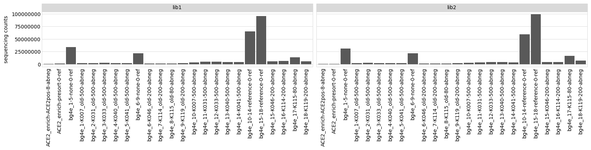
    


Also curious to see how many unique barcodes there are per sample. 


```python
p = (
    ggplot((variants.variant_count_df
            .query('count>20')
            [['library', 'sample', 'barcode']]
            .drop_duplicates()
            .reset_index()
           ),
           aes('sample')) +
    geom_bar() + 
    facet_wrap('~library')+
    theme(axis_text_x=element_text(angle=90),
          figure_size=(0.4 * variants.variant_count_df['sample'].nunique() * variants.variant_count_df['library'].nunique(), 2),
          panel_grid_major_x=element_blank()) +
    xlab('') +
    ylab('barcodes with >20 counts')
    )

_ = p.draw()
```


    
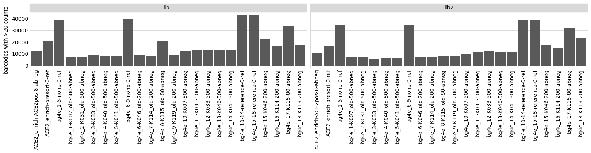
    


Analyze the variant counts per cell for each sample:


```python
counts = (
    variants.variant_count_df
    .groupby(['library', 'sample'])
    .aggregate({'count': 'sum'})
    .merge(sample_info, on=['library', 'sample'], validate='one_to_one')
    .merge(variants.n_variants_df(samples=None)
                   .groupby('library')
                   .aggregate(n_variants=pd.NamedAgg('count', 'sum')),
           on='library', validate='many_to_one')
    .assign(counts_per_cell=lambda x: x['count'] / x['number_cells'])
    .drop(columns=['R1', 'date'])
    )

counts.head()
```


<div>
<style scoped>
    .dataframe tbody tr th:only-of-type {
        vertical-align: middle;
    }

    .dataframe tbody tr th {
        vertical-align: top;
    }

    .dataframe thead th {
        text-align: right;
    }
</style>
<table border="1" class="dataframe">
  <thead>
    <tr style="text-align: right;">
      <th></th>
      <th>library</th>
      <th>sample</th>
      <th>count</th>
      <th>experiment</th>
      <th>antibody</th>
      <th>concentration</th>
      <th>sort_bin</th>
      <th>experiment_type</th>
      <th>number_cells</th>
      <th>frac_escape</th>
      <th>n_variants</th>
      <th>counts_per_cell</th>
    </tr>
  </thead>
  <tbody>
    <tr>
      <th>0</th>
      <td>lib1</td>
      <td>ACE2_enrich-ACE2pos-8-abneg</td>
      <td>769161</td>
      <td>ACE2_enrich</td>
      <td>ACE2pos</td>
      <td>8</td>
      <td>abneg</td>
      <td>ab_selection</td>
      <td>31118467.0</td>
      <td>0.900</td>
      <td>44115</td>
      <td>0.024717</td>
    </tr>
    <tr>
      <th>1</th>
      <td>lib1</td>
      <td>ACE2_enrich-presort-0-ref</td>
      <td>1235707</td>
      <td>ACE2_enrich</td>
      <td>presort</td>
      <td>0</td>
      <td>ref</td>
      <td>ab_selection</td>
      <td>NaN</td>
      <td>NaN</td>
      <td>44115</td>
      <td>NaN</td>
    </tr>
    <tr>
      <th>2</th>
      <td>lib1</td>
      <td>bg4e_1-5-none-0-ref</td>
      <td>33976656</td>
      <td>bg4e_1-5</td>
      <td>none</td>
      <td>0</td>
      <td>ref</td>
      <td>ab_selection</td>
      <td>NaN</td>
      <td>NaN</td>
      <td>44115</td>
      <td>NaN</td>
    </tr>
    <tr>
      <th>3</th>
      <td>lib1</td>
      <td>bg4e_1-K007_old-500-abneg</td>
      <td>2169579</td>
      <td>bg4e_1</td>
      <td>K007_old</td>
      <td>500</td>
      <td>abneg</td>
      <td>ab_selection</td>
      <td>527450.0</td>
      <td>0.051</td>
      <td>44115</td>
      <td>4.113336</td>
    </tr>
    <tr>
      <th>4</th>
      <td>lib1</td>
      <td>bg4e_2-K031_old-500-abneg</td>
      <td>2079352</td>
      <td>bg4e_2</td>
      <td>K031_old</td>
      <td>500</td>
      <td>abneg</td>
      <td>ab_selection</td>
      <td>524121.0</td>
      <td>0.044</td>
      <td>44115</td>
      <td>3.967313</td>
    </tr>
  </tbody>
</table>
</div>


For the each experiment type, plot the average counts per variant, the average cells per variant, and the average counts per cell for each library / sample:


```python

p = (
    ggplot(counts
                 .assign(counts_per_variant=lambda x: x['count'] / x['n_variants'],
                         cells_per_variant=lambda x: x['number_cells'] / x['n_variants'])
                 .melt(id_vars=['library', 'sample'],
                       value_vars=['counts_per_variant', 'cells_per_variant', 'counts_per_cell'],
                       var_name='statistic'),
           aes('sample', 'value')) +
    geom_bar(stat='identity') +
    facet_grid('statistic ~ library', scales='free_y') +
    theme(axis_text_x=element_text(angle=90),
          figure_size=(0.4 * counts['sample'].nunique() * counts['library'].nunique(), 6),
          panel_grid_major_x=element_blank()) +
    xlab('')
    )

_ = p.draw()
```


    
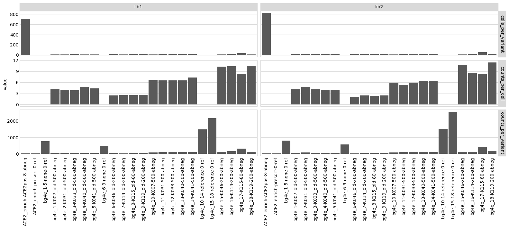
    


## Mutations per variant
Average number of mutations per gene among all variants. To make the plot not too big, chunk the plots out for smaller subsets:


```python
i = 0
chunksize = 8

while i < counts['sample'].nunique(): 
    p = variants.plotNumCodonMutsByType(variant_type='all',
                                        orientation='v',
                                        libraries=variants.libraries,
                                        samples=counts['sample'].unique().tolist()[i: i + chunksize],
                                        heightscale=0.8)
    p = p + theme(panel_grid_major_x=element_blank())  # no vertical grid lines
    _ = p.draw()

    i += chunksize
```


    
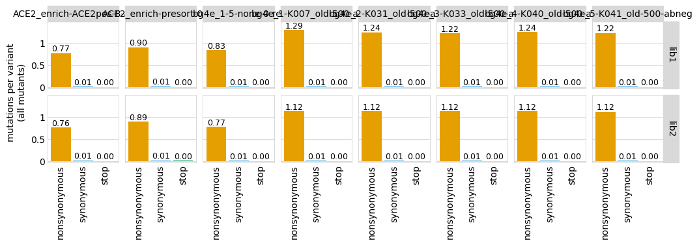
    


    

    


    
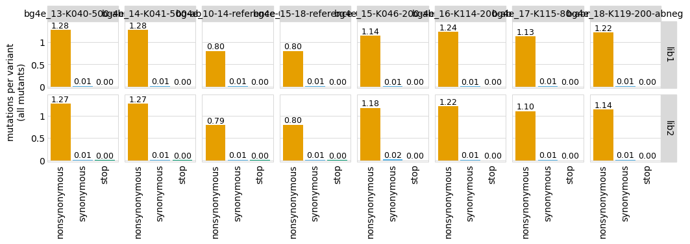
    


Mutation frequency across gene among all variants:


```python
i = 0
chunksize = 8

while i < counts['sample'].nunique():    
    p = variants.plotMutFreqs('all',
                              'codon',
                              orientation='v',
                              libraries=variants.libraries,
                              samples=counts['sample'].unique().tolist()[i: i + chunksize],
                             )
    _ = p.draw()
    i += chunksize
```


    
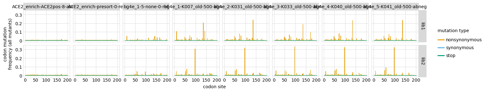
    


    
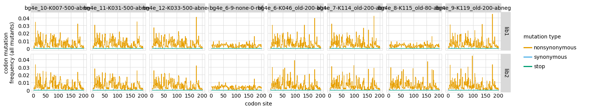
    


    
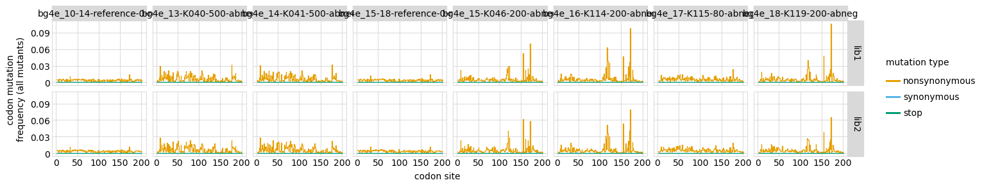
    


Now plot the average mutation frequency for all samples:


```python
i = 0
chunksize = 8

while i < counts['sample'].nunique():
    p = variants.plotNumCodonMutsByType(
                                    variant_type='all',
                                    orientation='v',
                                    libraries=variants.libraries,
                                    samples=counts['sample'].unique().tolist()[i: i + chunksize],
                                    heightscale=0.9,
                                    widthscale=1.1)
    p = p + theme(panel_grid_major_x=element_blank())  # no vertical grid lines
    _ = p.draw()
    i += chunksize
```


    
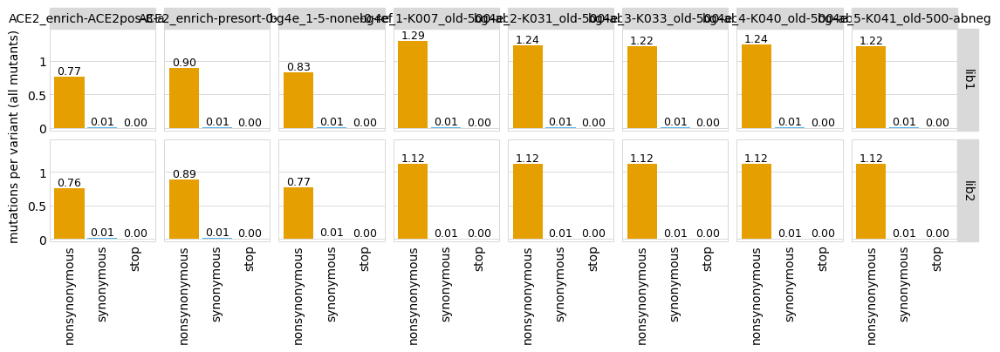
    


    
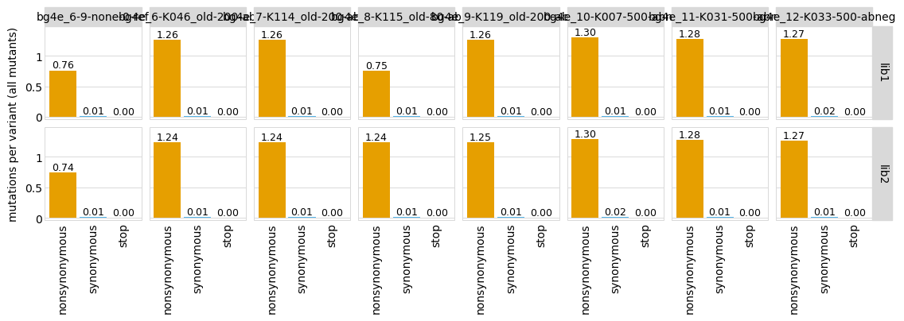
    


    
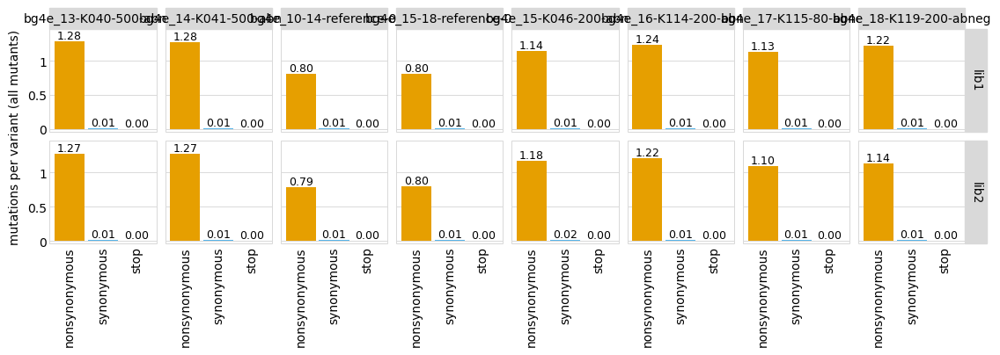
    


```python

```
